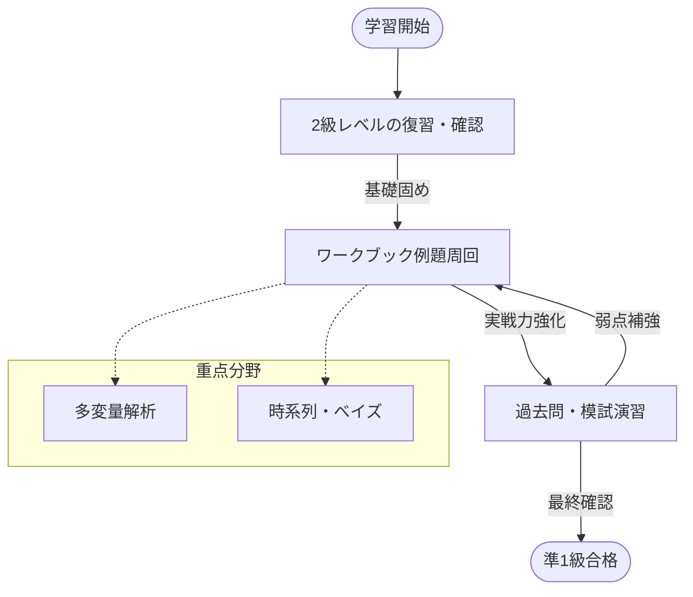

# 第0章 受験戦略と学習ガイド

## 1. 統計検定準1級の位置付けと実務的価値

> [!TIP]
> **【準1級合格のポイント：2級との決定的な違い】**
> 2級は「算出結果の解釈」が中心ですが、準1級は「手法の数理的背景の理解」と「適切な手法の選択」が問われます。
> 特に数式（確率密度関数や尤度関数）を自分で組み立てて計算する力が必須となります。

統計検定準1級は、データサイエンスの実務能力と理論的理解の双方を問うハイレベルな試験です。
- **2級**: 大学教養レベルの基礎統計学（記述統計、基礎的な推測統計）。
- **準1級**: **大学専門課程レベルの応用統計学**。
    - 多変量解析、時系列解析、ベイズ統計、シミュレーションなど、現代のデータ分析に不可欠な広範な手法を扱います。
    - これらを「正しく選択し」「解釈し」「適用できるか」が問われます。

## 2. CBT方式 (Computer Based Testing) の最新トレンド (2024-2025)
現在はテストセンターでのCBT方式に完全移行しており、試験傾向が定着してきています。

| 特徴 | 旧PBT (筆記) | **現CBT** |
|---|---|---|
| 時間 | 120分 | **90分** |
| 問題数 | 大問構成 | **25〜30問 (小問集合)** |
| 形式 | 論述あり | **多肢選択・数値入力** |
| 合格基準 | 相対評価 | **60点以上 (100点満点)** ※目安 |

### ⚠️ CBT試験の重要対策ポイント
1.  **広範囲からの出題**:
    PBT時代は大問選択ができましたが、CBTでは全範囲からランダムに出題されます。「捨て分野」を作ると合格が厳しくなります。特に**ベイズ統計、時系列解析、多変量解析**は頻出です。
2.  **数値入力の落とし穴**:
    部分点が一切ありません。計算過程が合っていても、最後の四捨五入や桁数を間違えれば0点です。
    - 「小数第2位まで」などの指示を絶対に見落とさないこと。
    - **負の符号**の入力漏れに注意。
3.  **スピード勝負**:
    1問あたり約3〜3.5分。悩んでいる時間はありません。「概念を理解しているか」を瞬時に問う問題と、「手計算が必要な」問題を見極め、時間配分を徹底してください。

## 3. 合格への学習ロードマップ

> [!TIP]
> **【準1級合格のポイント：ワークブックの「行間」を埋める】**
> 公式ワークブックは解説が簡潔な箇所（「〜となることは明らか」など）があります。
> この「行間」にある途中計算や論理の飛躍を、自分で手を動かして埋められるようになることが合格レベルへの到達点です。

### 必須教材：「統計学実践ワークブック」
日本統計学会公式の『統計検定準1級対応 統計学実践ワークブック』は、合格に不可欠なバイブルです。
- 試験のコア部分は本書の例題をベースに出題されます。
- **全32章の例題**を、ヒントなしで完答できるレベルまで仕上げることがスタートラインです。

### 推奨学習ステップ
1.  **2級レベルの完全習得**:
    準1級は2級の知識（推定・検定・回帰分析の基礎）が前提です。不安な場合はここから復習しましょう。
2.  **ワークブック周回**:
    まずは「読む」だけでなく「手を動かす」。数式の変形や、なぜその検定統計量を使うのかを意識してください。
3.  **CBT模試・過去問演習**:
    『統計検定 準1級・1級 公式問題集』で過去問に触れます。CBT特有の「短いリード文で要点を突く」形式に慣れることが重要です。

## 4. 分野別・重点学習ポイント

> [!TIP]
> **【準1級合格のポイント：「捨て分野」を作らない】**
> 全範囲から万遍なく出題されるため、特定の苦手分野（例えば「時系列だけは捨てる」など）を作ると、その分野の配点分がそのまま失点になり致命的です。
> 至少基本用語と基本的な計算手順だけは押さえておくのが得策です。
    

### 📊 確率分布・推定・検定 (基礎)
- **変数変換**: ヤコビアンの使い方、累積分布関数法をマスターする。
- **最尤法**: 対数尤度関数の微分計算は息をするようにできるように。

### 📈 多変量解析 (得点源)
- **重回帰分析**: $t$検定と$F$検定の違い、多重共線性のVIF、変数選択(AIC/BIC)の基準。
- **主成分分析**: 固有値・固有ベクトルの意味、累積寄与率80%の目安。
- **判別分析・因子分析**: 各手法の目的と、出力結果の読み取り方。

### ⏱️ 時系列・ベイズ (合否を分ける応用)
- **時系列**: AR/MAモデルの自己相関(ACF)/偏自己相関(PACF)の挙動パターンは暗記必須。
- **ベイズ**: 事後分布の導出、共役事前分布の性質、ベイズ因子の解釈。

### 💻 シミュレーション・その他
- **モンテカルロ法**: 乱数生成の仕組み（逆関数法）と積分計算への応用。
- **ノンパラメトリック**: ウィルコクソンの順位和検定などの手順と適用条件。

---
本ノート群は、このワークブックの広範な内容を整理し、視覚的な理解を助けるために作成されました。
各章の冒頭にある **【準1級での学習深度と対策】** を読み、メリハリをつけて学習を進めてください。
