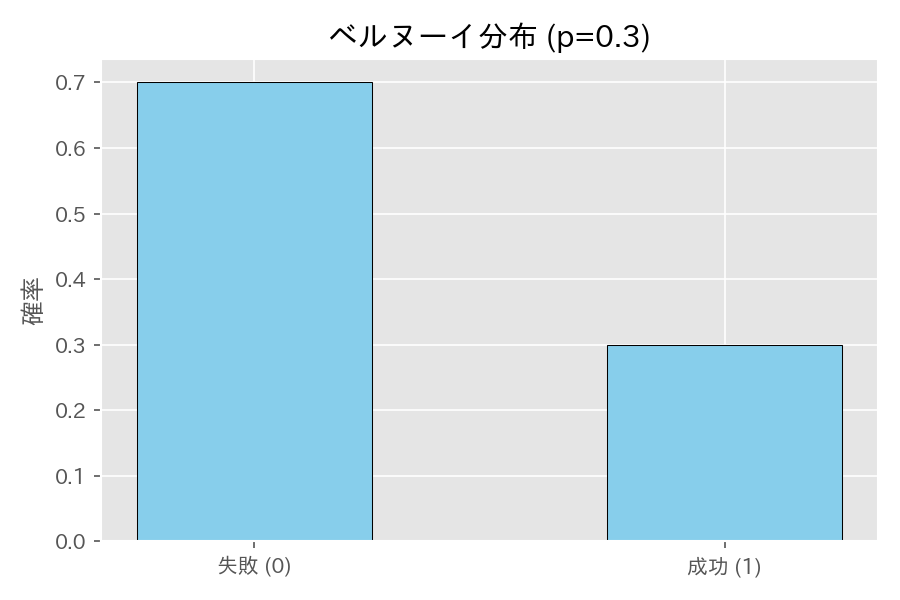
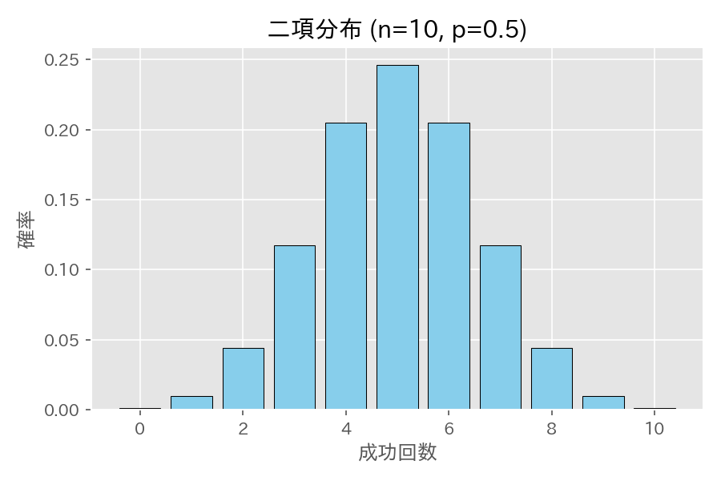
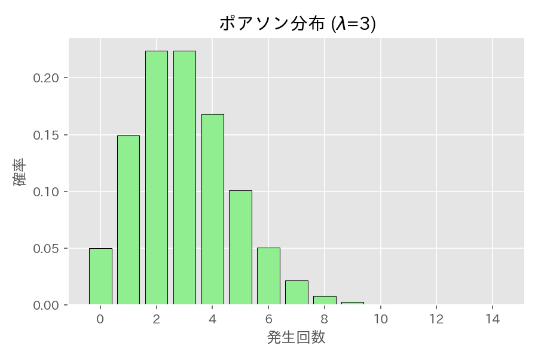
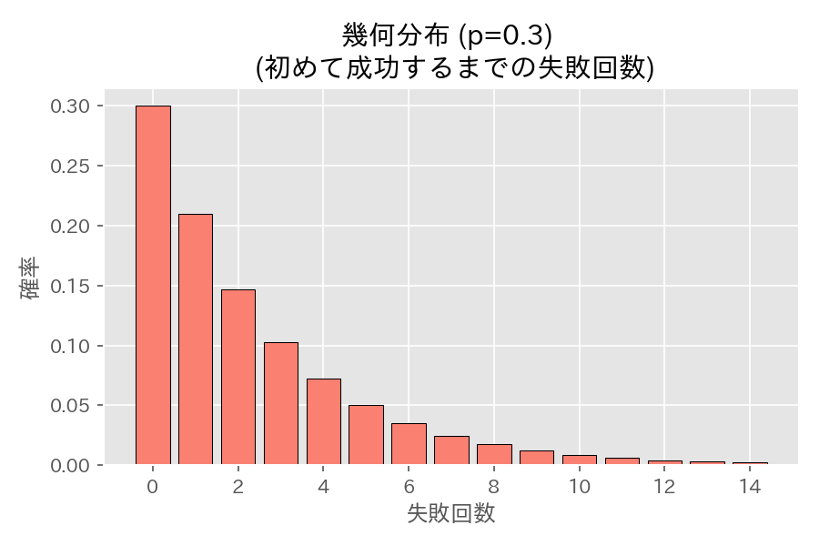
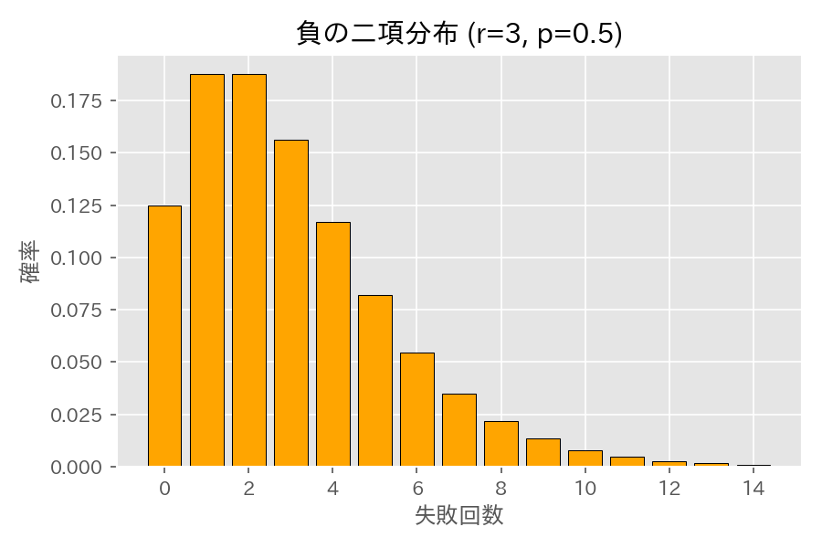
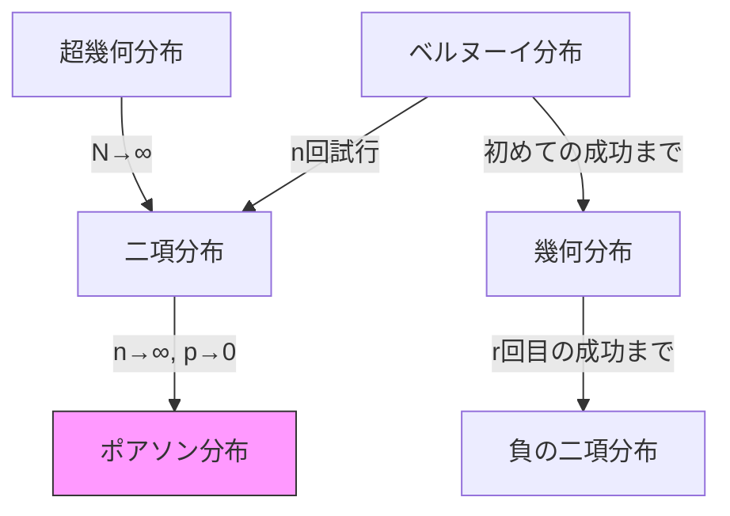

# 第５章　離散型分布

> [!IMPORTANT]
> **【準1級での学習深度と対策】**
> 各種離散分布の「定義」「期待値・分散」「適用場面」を完全に整理して頭に入れる必要があります。
>
> 1.  **パラメータと期待値・分散の暗記（必須）**:
>     二項分布、ポアソン分布、幾何分布、超幾何分布、負の二項分布。これらは導出もできるのが理想ですが、試験中は公式を即座に出せるスピードが重要です。
> 2.  **ポアソン分布の性質**:
>     「稀な事象の発生数」としてのポアソン分布。二項分布からの近似（$np \to \lambda$）や、再生性、間隔が指数分布に従うことなど、周辺知識が問われます。
> 3.  **幾何分布の無記憶性**:
>     「初めて成功するまでの回数」における無記憶性（過去の失敗は未来の確率に影響しない）の概念を理解しておきましょう。

## 1. 基本的な成功・失敗の分布

> [!TIP]
> **【準1級合格のポイント：分散の最大値】**
> ベルヌーイ試行や二項分布の分散 $p(1-p)$ は、$p=0.5$ のとき最大になります。
> 「五分五分の勝負が一番結果がばらつく（読みづらい）」とイメージしておくと、感覚的な検算に使えます。

### ベルヌーイ分布 (Bernoulli Distribution)
結果が「成功」「失敗」の2通りしかない試行（ベルヌーイ試行）を1回行う分布。
- 表記: $Bin(1, p)$
- 確率関数: $P(X=x) = p^x (1-p)^{1-x} \quad (x=0, 1)$

$$
E[X] = p, \quad V[X] = p(1-p), \quad G_X(s) = 1-p+ps
$$

### 二項分布 (Binomial Distribution)
成功確率 $p$ の独立なベルヌーイ試行を $n$ 回行ったときの成功回数の分布。
- 表記: $Bin(n, p)$
- 確率関数: $P(X=x) = {}_nC_x p^x (1-p)^{n-x} \quad (x=0, \dots, n)$

$$
E[X] = np, \quad V[X] = np(1-p), \quad G_X(s) = (1-p+ps)^n
$$

> [!NOTE]
> **再生性**: $X_1 \sim Bin(n_1, p), X_2 \sim Bin(n_2, p)$ (独立) $\implies X_1+X_2 \sim Bin(n_1+n_2, p)$

## 2. 稀な事象の分布

> [!TIP]
> **【準1級合格のポイント：平均＝分散】**
> ポアソン分布の最大の特徴は「平均 $E[X]$ と分散 $V[X]$ が等しい値（$\lambda$）になる」ことです。
> データが与えられたとき、「平均と分散を計算したらほぼ等しかった $\to$ ポアソン分布を仮定すべきだ」という判断ロジックは頻出です。

### ポアソン分布 (Poisson Distribution)
単位時間(空間)あたり平均 $\lambda$ 回起きる事象の発生回数の分布。
- 表記: $Po(\lambda)$
- 確率関数: $P(X=x) = \frac{\lambda^x e^{-\lambda}}{x!} \quad (x=0, 1, \dots)$

$$
E[X] = \lambda, \quad V[X] = \lambda, \quad G_X(s) = e^{\lambda(s-1)}
$$

> [!TIP]
> **少数の法則**: 二項分布で $n \to \infty, p \to 0$ ($np=\lambda$ 一定) とするとポアソン分布に収束します。
>
> **再生性**:
> 互いに独立な $X \sim Po(\lambda_1), Y \sim Po(\lambda_2)$ に対し、$X+Y \sim Po(\lambda_1+\lambda_2)$ となります。
> 「1時間あたりの客数」など、期間や範囲を合算する場合にパラメータ（平均）を足し算できるという直感的性質です。

## 3. 待ち時間の分布

> [!TIP]
> **【準1級合格のポイント：無記憶性の意味】**
> 「3回連続で失敗した」という事実があっても、「ここからさらに5回失敗する確率」は変わりません。
> 「そろそろ当たるはず（確率の収束）」というギャンブラーの誤謬は、少なくとも幾何分布には通用しません。問題文のひっかけに注意。

### 幾何分布 (Geometric Distribution)
初めて成功するまでの**失敗回数**の分布。
- 表記: $Geo(p)$
- 確率関数: $P(X=x) = (1-p)^x p \quad (x=0, 1, \dots)$

$$
E[X] = \frac{1-p}{p}, \quad V[X] = \frac{1-p}{p^2}, \quad G_X(s) = \frac{p}{1-(1-p)s}
$$

> [!NOTE]
> **無記憶性**: $P(X \ge m+n | X \ge m) = P(X \ge n)$
> 過去の失敗回数は、今後の成功確率に影響しません。

### 負の二項分布 (Negative Binomial Distribution)
$r$ 回目の成功が起きるまでの**失敗回数**の分布（幾何分布の一般化）。
- 表記: $NB(r, p)$
- 確率関数: $P(X=x) = {}_{x+r-1}C_x p^r (1-p)^x \quad (x=0, 1, \dots)$

$$
E[X] = \frac{r(1-p)}{p}, \quad V[X] = \frac{r(1-p)}{p^2}, \quad G_X(s) = \left(\frac{p}{1-(1-p)s}\right)^r
$$

## 4. その他の離散型分布

> [!TIP]
> **【準1級合格のポイント：超幾何分布か二項分布か】**
> くじ引き問題で「引いたくじを戻す（復元）」なら二項分布、「戻さない（非復元）」なら超幾何分布です。
> ただし、母集団 $N$ が非常に大きいときは、戻さなくても確率はほとんど変わらないため、計算が楽な二項分布で近似します。

### 離散一様分布 (Discrete Uniform Distribution)
$k$ 通りの事象が等確率で起きる分布（サイコロなど）。
- $P(X=x) = 1/k$
- $E[X] = (k+1)/2, \quad V[X] = (k^2-1)/12$

### 超幾何分布 (Hypergeometric Distribution)
$N$ 本中 $M$ 本当たりのくじから $n$ 本を**非復元抽出**したときの当たりの数。
- 表記: $HG(N, M, n)$
- 確率関数: $P(X=x) = \frac{{}_MC_x {}_{N-M}C_{n-x}}{{}_NC_n}$

$$
E[X] = n \frac{M}{N}, \quad V[X] = n \frac{M}{N} (1-\frac{M}{N}) \frac{N-n}{N-1}
$$

### 多項分布 (Multinomial Distribution)
結果が $k$ 通り（確率 $p_1, \dots, p_k$）の試行を $n$ 回行う場合の各結果の回数分布（二項分布の多変量化）。
- 共分散: $Cov[X_i, X_j] = -n p_i p_j \quad (i \ne j)$
- 相関係数: $\rho[X_i, X_j] = -\sqrt{\frac{p_i p_j}{(1-p_i)(1-p_j)}}$

## 5. 分布間の関係性まとめ

> [!TIP]
> **【準1級合格のポイント：分布の極限関係】**
> この「分布間のつながり」は、CBTの概念理解問題でよく問われます。
> 「二項分布の $n$ を大きくするとポアソン分布になる（$p$ 小）」か「正規分布になる（$p$ 固定）」か、条件の違いを整理しておきましょう。

代表的な離散型分布は、以下のような密接な関係を持っています。

| 関係元 | 関係先 | 関係の概要 |
| :--- | :--- | :--- |
| **ベルヌーイ分布** | **二項分布** | 試行回数を $1 \to n$ に拡張（独立和） |
| **二項分布** | **ポアソン分布** | $n \to \infty, p \to 0$ ($np = \lambda$) の極限（少数の法則） |
| **ベルヌーイ分布** | **幾何分布** | 「成功数」ではなく「初めて成功するまでの回数」に着目 |
| **幾何分布** | **負の二項分布** | 成功回数を $1 \to r$ に拡張（独立和＝再生性） |
| **超幾何分布** | **二項分布** | 母集団 $N \to \infty$ の極限（非復元抽出 $\approx$ 復元抽出） |

### 分布間の関係性まとめ

## 6. 離散型分布の期待値・分散まとめ

> [!TIP]
> **【準1級合格のポイント：暗記の優先順位】**
> 試験中に $\sum$ 計算をしている時間はありません。
> ポアソン分布、幾何分布、二項分布の期待値・分散は「九九」のように即答できるように暗記してください。

CBT試験対策として、以下の主要な分布の期待値・分散は**暗記推奨**です。

| 分布名 | 表記 | 確率関数 $P(X=x)$ | 期待値 $E[X]$ | 分散 $V[X]$ | 備考 |
| :--- | :--- | :--- | :--- | :--- | :--- |
| **離散一様分布** | $U(k)$ | $\frac{1}{k}$ | $\frac{k+1}{2}$ | $\frac{k^2-1}{12}$ | サイコロ ($k=6$) |
| **ベルヌーイ分布** | $Bin(1, p)$ | $p^x (1-p)^{1-x}$ | $p$ | $p(1-p)$ | 試行回数1回 |
| **二項分布** | $Bin(n, p)$ | ${}_nC_x p^x (1-p)^{n-x}$ | $np$ | $np(1-p)$ | ベルヌーイ試行の和 |
| **ポアソン分布** | $Po(\lambda)$ | $\frac{\lambda^x e^{-\lambda}}{x!}$ | $\lambda$ | $\lambda$ | 稀な事象の回数 |
| **幾何分布** | $Geo(p)$ | $(1-p)^x p$ | $\frac{1-p}{p}$ | $\frac{1-p}{p^2}$ | 初めて成功するまでの**失敗数** |
| **負の二項分布** | $NB(r, p)$ | ${}_{x+r-1}C_x p^r (1-p)^x$ | $\frac{r(1-p)}{p}$ | $\frac{r(1-p)}{p^2}$ | $r$回成功するまでの**失敗数** |
| **超幾何分布** | $HG(N, M, n)$ | $\frac{{}_MC_x {}_{N-M}C_{n-x}}{{}_NC_n}$ | $n\frac{M}{N}$ | $n\frac{M}{N}(1-\frac{M}{N})\frac{N-n}{N-1}$ | 非復元抽出 |

> [!WARNING]
> **幾何分布・負の二項分布の定義に注意**
> 本チートシートでは、「初めて成功するまでの**失敗回数**」を確率変数 $X$ としています。（$x=0, 1, \dots$）
> 「初めて成功するまでの**試行回数**」を $Y$ ($y=1, 2, \dots$) とする定義の場合、期待値・分散は異なります。
> - $E[Y] = E[X] + 1 = \frac{1}{p}$
> - $V[Y] = V[X] = \frac{1-p}{p^2}$