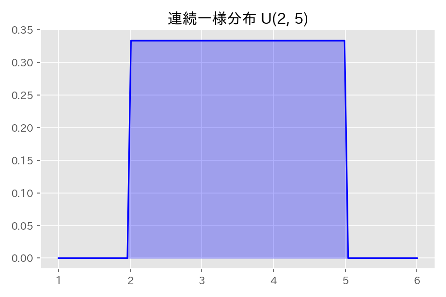
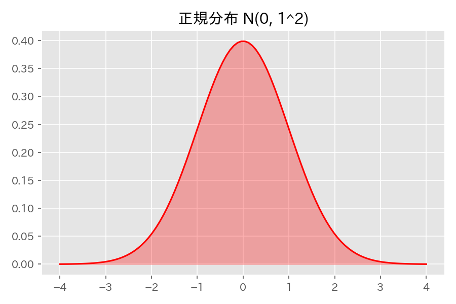
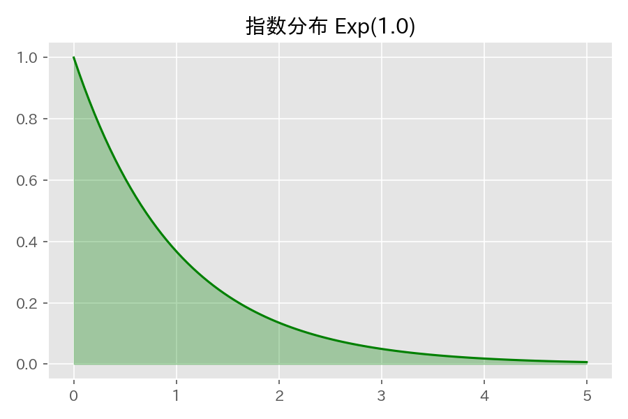
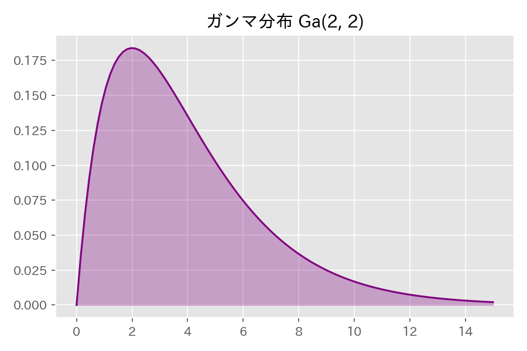
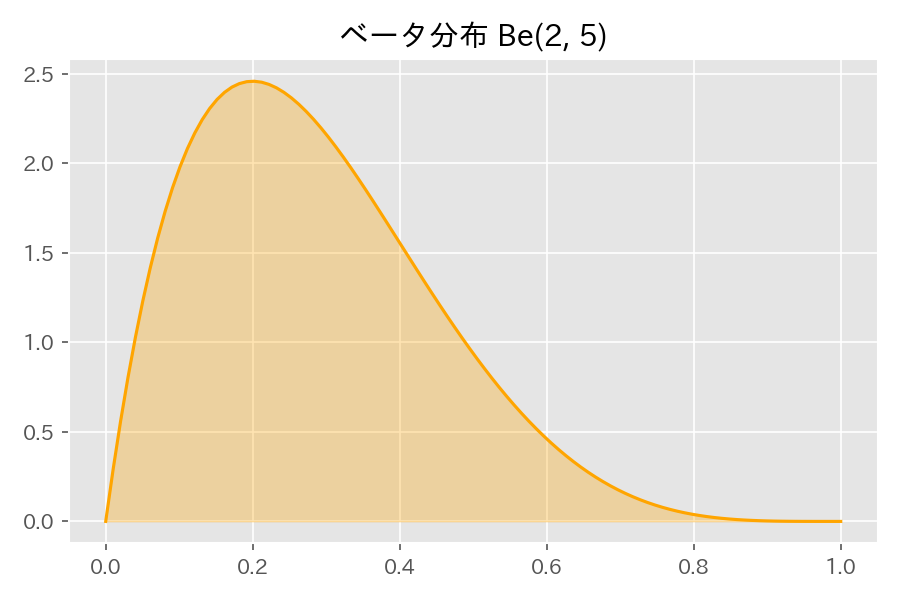
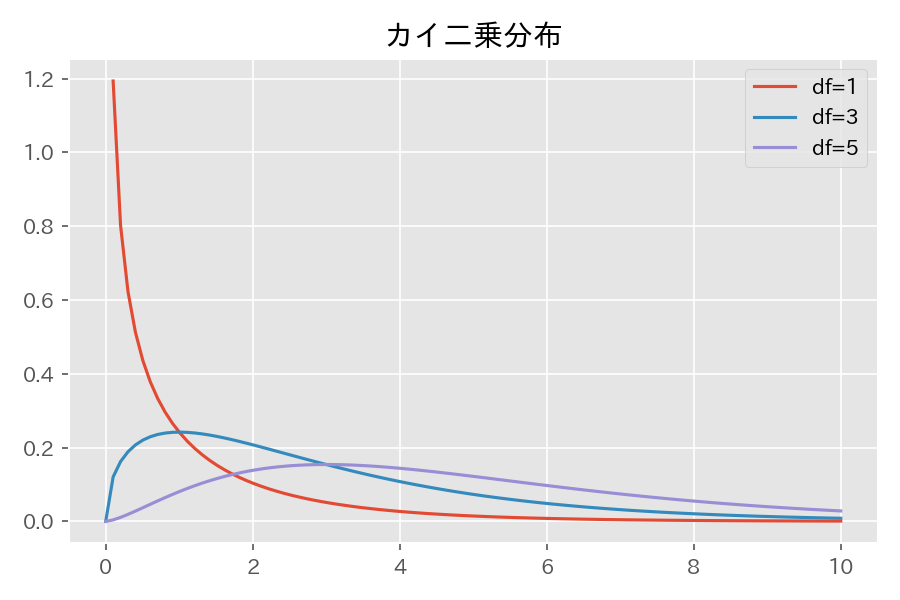
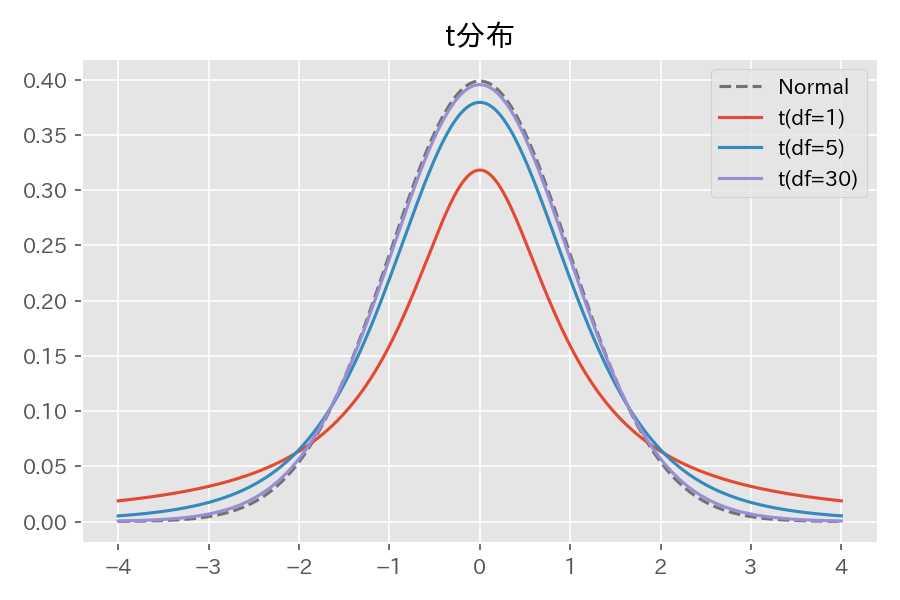
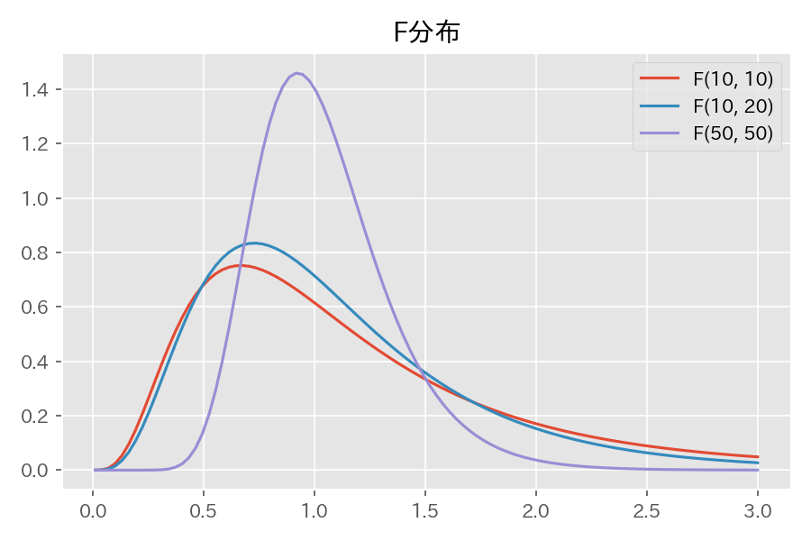
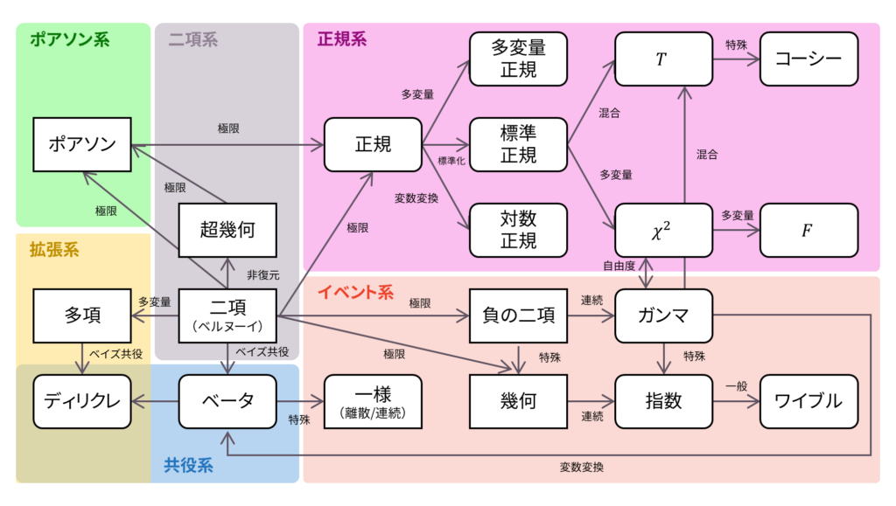

# 第６章　連続型分布と標本分布

> [!IMPORTANT]
> **【準1級での学習深度と対策】**
> 正規分布からの派生分布（カイ二乗、t、F）の定義と性質は、後の検定・推定分野の土台となります。
>
> 1.  **3大標本分布の定義（必須）**:
>     標準正規分布に従う変数を用いた $\chi^2, t, F$ 分布の構成式を暗記してください。
>     -   $\chi^2 = \sum Z_i^2$
>     -   $t = Z / \sqrt{W/n}$
>     -   $F = (W_1/m) / (W_2/n)$
> 2.  **ベータ分布とガンマ分布**:
>     これらの分布の確率密度関数の形状や、共役事前分布としての役割（ベイズ統計）を意識して学習しましょう。
> 3.  **無記憶性**:
>     指数分布の無記憶性を、条件付き確率の式変形で証明できるように。

## 1. 代表的な連続型分布

### 連続一様分布 (Continuous Uniform Distribution)
区間 $[a, b]$ で一定の確率密度をもつ分布。
- 表記: $U(a, b)$
- PDF: $f(x) = \frac{1}{b-a} \quad (a < x < b)$

$$
E[X] = \frac{a+b}{2}, \quad V[X] = \frac{(b-a)^2}{12}, \quad M_X(t) = \frac{e^{tb}-e^{ta}}{t(b-a)}
$$

### 正規分布 (Normal Distribution)
平均 $\mu$ を中心とする対称な釣鐘型の分布。
- 表記: $N(\mu, \sigma^2)$
- PDF: $f(x) = \frac{1}{\sqrt{2\pi}\sigma} \exp\left(-\frac{(x-\mu)^2}{2\sigma^2}\right)$

$$
E[X] = \mu, \quad V[X] = \sigma^2, \quad M_X(t) = \exp(\mu t + \frac{\sigma^2 t^2}{2})
$$

> [!NOTE]
> **再生性**: $X_i \sim N(\mu_i, \sigma_i^2)$ (独立) $\implies \sum a_i X_i \sim N(\sum a_i \mu_i, \sum a_i^2 \sigma_i^2)$

### 指数分布 (Exponential Distribution)
事象が起きるまでの待ち時間や寿命など。
- 表記: $Exp(\lambda)$
- PDF: $f(x) = \lambda e^{-\lambda x} \quad (x > 0)$
  （$\lambda$: レートパラメータ、単位時間あたりの発生率）

$$
E[X] = \frac{1}{\lambda}, \quad V[X] = \frac{1}{\lambda^2}, \quad M_X(t) = \frac{\lambda}{\lambda - t}
$$

> [!TIP]
> **無記憶性**: $P(X > a+b | X > a) = P(X > b)$

### ガンマ分布 (Gamma Distribution)
指数分布の一般化 ($Exp(\lambda) = Ga(1, \beta=1/\lambda)$)。
- 表記: $Ga(\alpha, \beta)$ ($\alpha$: 形状母数, $\beta$: 尺度母数)
- PDF: $f(x) = \frac{1}{\Gamma(\alpha)\beta^\alpha} x^{\alpha-1} e^{-\frac{x}{\beta}} \quad (x > 0)$

$$
E[X] = \alpha\beta, \quad V[X] = \alpha\beta^2, \quad M_X(t) = (1 - \beta t)^{-\alpha}
$$

> [!WARNING]
> **【パラメータ定義の注意 (公式準拠)】**
> 統計検定公式テキスト等では、**指数分布はレートパラメータ $\lambda$**、**ガンマ分布はスケールパラメータ $\beta$** を用いる定義が混在することがあります。
> - 指数分布: $e^{-\lambda x}$
> - ガンマ分布: $e^{-x/\beta}$
>
> 本ノートでもこれに倣いますが、**$Exp(\lambda)$ は $Ga(1, \beta=1/\lambda)$ に対応する**（パラメータが逆数になる）点に十分注意してください。

### ベータ分布 (Beta Distribution)
$0 < x < 1$ の範囲をとる分布。
- 表記: $Be(a, b)$
- PDF: $f(x) = \frac{1}{B(a, b)} x^{a-1} (1-x)^{b-1}$

$$
E[X] = \frac{a}{a+b}, \quad V[X] = \frac{ab}{(a+b)^2(a+b+1)}
$$

### 対数正規分布 (Log-Normal Distribution)
$Y \sim N(\mu, \sigma^2)$ のとき $X = e^Y$ が従う分布。
- 表記: $\Lambda(\mu, \sigma^2)$
- **性質**:
  - 中央値: $e^\mu$ （元の正規分布の中央値 $\mu$ を指数変換したもの）
  - 最頻値: $e^{\mu - \sigma^2}$

$$
E[X] = e^{\mu + \sigma^2/2}, \quad V[X] = e^{2\mu + \sigma^2} (e^{\sigma^2} - 1)
$$

## 2. 正規分布に関連する分布 (標本分布)

### カイ二乗分布 (Chi-squared Distribution)
標準正規分布の二乗和が従う分布。
- 表記: $\chi^2(n)$ ($n$: 自由度)
- **定義**: $Z_1, \dots, Z_n \sim N(0, 1) \implies \sum Z_i^2 \sim \chi^2(n)$

$$
E[X] = n, \quad V[X] = 2n
$$

### t分布 (Student's t-Distribution)
正規分布母平均の検定などに利用。
- 表記: $t(n)$
- **定義**: $Z \sim N(0, 1), Y \sim \chi^2(n) \implies T = \frac{Z}{\sqrt{Y/n}} \sim t(n)$

$$
E[T] = 0 \ (n>1), \quad V[T] = \frac{n}{n-2} \ (n>2)
$$

### F分布 (F-Distribution)
等分散性の検定などに利用。
- 表記: $F(n_1, n_2)$
- **定義**: $X_1 \sim \chi^2(n_1), X_2 \sim \chi^2(n_2) \implies F = \frac{X_1/n_1}{X_2/n_2} \sim F(n_1, n_2)$

## 3. 多変量と混合分布

### 多変量正規分布
$k$次元ベクトル $\mathbf{x}$ が平均ベクトル $\boldsymbol{\mu}$、分散共分散行列 $\Sigma$ に従うとき。
- 表記: $N(\boldsymbol{\mu}, \Sigma)$
- 条件付き分布 $E[X_2|X_1=x_1]$ は $x_1$ の一次式になります。

### 混合正規分布とEMアルゴリズム
複数の正規分布の重ね合わせモデル。パラメタ推定には **EMアルゴリズム** を用います。
1. **Eステップ**: 現在のパラメタ推定値を用いて、各データがどの成分から来たかの事後確率（負担率）を計算。
2. **Mステップ**: 負担率を用いて、パラメタ（平均・分散・混合比）を更新（重み付き平均など）。

> [!NOTE]
> 混合分布モデルとEMアルゴリズムの詳細は [第24章 クラスター分析](/?note=24_クラスター分析)（非階層的手法）や [第29章 不完全データの統計処理](/?note=29_不完全データの統計処理) でも関連事項を扱います。

## 4. 順序統計量 (Order Statistics)
独立に同一の分布に従う $n$ 個の標本 $X_1, \dots, X_n$ を小さい順に並べ替えたものを $X_{(1)} \le X_{(2)} \le \dots \le X_{(n)}$ とします。

### 最小値と最大値の分布
- **最大値 $X_{(n)}$ のCDF**: $F_{max}(x) = \{F(x)\}^n$
- **最小値 $X_{(1)}$ のCDF**: $F_{min}(x) = 1 - \{1 - F(x)\}^n$

確率密度関数 (PDF) はこれらを微分して求めます。
$$ f_{max}(x) = n \{F(x)\}^{n-1} f(x) $$
$$ f_{min}(x) = n \{1-F(x)\}^{n-1} f(x) $$

> [!TIP]
> **【頻出例題：指数分布の最小値】**
> $X_i \sim Exp(\lambda)$ のとき、最小値 $X_{(1)}$ もまた指数分布に従います。
> $1 - F(x) = e^{-\lambda x}$ なので、
> $$ 1 - F_{min}(x) = (e^{-\lambda x})^n = e^{-n\lambda x} $$
> つまり **$X_{(1)} \sim Exp(n\lambda)$** となります（レートパラメータが $n$ 倍になる、つまり寿命が $1/n$ に縮む）。

## 5. 分布間の関係性まとめ

連続型分布間の重要な関係性の図解です。

> [!NOTE]
> **ガンマ分布とベータ分布の関係**
> 独立な $X \sim Ga(\alpha, \lambda), Y \sim Ga(\beta, \lambda)$ に対し、
> $$ \frac{X}{X+Y} \sim Be(\alpha, \beta) $$
> となります。これはベイズ統計での事後分布導出などで重要な性質です。

| 関係元 | 関係先 | 関係の概要 |
| :--- | :--- | :--- |
| **標準正規分布** | **一様正規分布** | 標準化変換 $Z = (X-\mu)/\sigma$ |
| **標準正規分布** | **カイ二乗分布** | 二乗和の分布 $\sum Z_i^2 \sim \chi^2(n)$ |
| **ガンマ分布** | **カイ二乗分布** | $\chi^2(n) = Ga(n/2, 2)$ (スケールパラメータ $\beta=2$) |
| **ガンマ分布** | **指数分布** | $Exp(\lambda) = Ga(1, 1/\lambda)$ |
| **カイ二乗分布** | **F分布** | 独立なカイ二乗変数の比 $(X_1/n_1)/(X_2/n_2)$ |
| **正規・カイ二乗** | **t分布** | 標準正規とカイ二乗の比 $Z/\sqrt{Y/n}$ |
| **t分布** | **F分布** | $T^2 \sim F(1, n)$ |

### 分布間の関係性まとめ

## 5. 連続型分布の期待値・分散まとめ

CBT試験対策として、以下の主要な分布の期待値・分散は**暗記推奨**です。

| 分布名 | 表記 | 確率密度関数(PDF) | 期待値 $E[X]$ | 分散 $V[X]$ | 備考 |
| :--- | :--- | :--- | :--- | :--- | :--- |
| **連続一様分布** | $U(a, b)$ | $\frac{1}{b-a}$ | $\frac{a+b}{2}$ | $\frac{(b-a)^2}{12}$ | 基本分布 |
| **正規分布** | $N(\mu, \sigma^2)$ | $\frac{1}{\sqrt{2\pi}\sigma}e^{-\frac{(x-\mu)^2}{2\sigma^2}}$ | $\mu$ | $\sigma^2$ | **最重要**、再生性あり |
| **指数分布** | $Exp(\lambda)$ | $\lambda e^{-\lambda x}$ | $\frac{1}{\lambda}$ | $\frac{1}{\lambda^2}$ | 無記憶性 |
| **ガンマ分布** | $Ga(\alpha, \beta)$ | $\propto x^{\alpha-1}e^{-x/\beta}$ | $\alpha\beta$ | $\alpha\beta^2$ | $Exp(\lambda)$の一般化 |
| **ベータ分布** | $Be(a, b)$ | $\propto x^{a-1}(1-x)^{b-1}$ | $\frac{a}{a+b}$ | $\frac{ab}{(a+b)^2(a+b+1)}$ | $0<x<1$ |
| **カイ二乗分布** | $\chi^2(n)$ | (覚えなくてよい) | $n$ | $2n$ | $n$: 自由度、再生性あり |
| **t分布** | $t(n)$ | (覚えなくてよい) | $0$ ($n>1$) | $\frac{n}{n-2}$ ($n>2$) | $n \to \infty$で正規分布 |
| **F分布** | $F(n_1, n_2)$ | (覚えなくてよい) | $\frac{n_2}{n_2-2}$ ($n_2>2$) | (複雑なので不要) | 右側検定で多用 |

