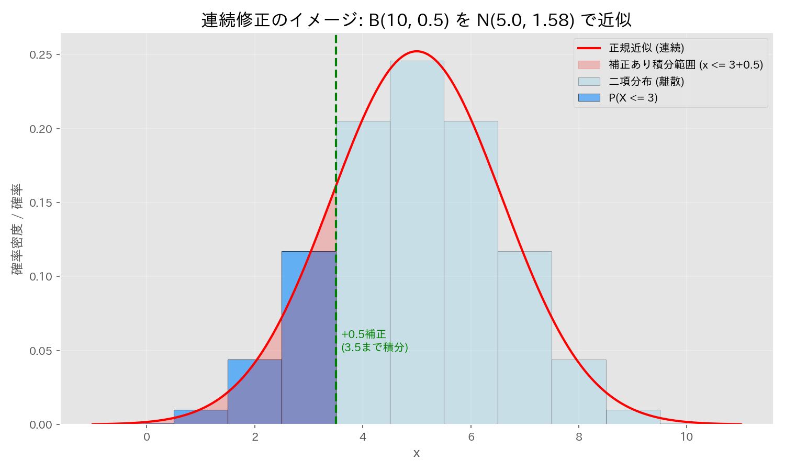

# 第７章　極限定理，漸近理論

> [!IMPORTANT]
> **【準1級での学習深度と対策】**
> 「$n$ が十分大きいとき」に成り立つ近似計算や性質を理解する分野です。
>
> 1.  **中心極限定理 (CLT)（必須）**:
>     母集団がどんな分布であっても、標本平均は正規分布に近づくという性質を使って、確率計算をする問題は頻出です。
> 2.  **一致性と漸近正規性**:
>     推定量が真の値に近づく「一致性」と、その分布が正規分布に近づく「漸近正規性」の定義と意味を理解しましょう。特に最尤推定量の漸近有効性は重要キーワードです。
> 3.  **確率収束と分布収束**:
>     大数の弱法則（確率収束）と中心極限定理（分布収束）の違いを、定義式レベルで区別できるように。

## 1. 確率変数列の収束

### 収束の概念と関係性
確率変数列 $X_1, X_2, \dots$ がある確率変数 $X$ に近づく概念は、強さの順に以下のように分類されます。

| 収束の種類 | 表記 | 定義 | 備考 |
| :--- | :--- | :--- | :--- |
| **概収束** (Almost Sure) | $X_n \xrightarrow{a.s.} X$ | $P(\lim_{n \to \infty} X_n = X) = 1$ | 最も強い収束概念の一つ。 |
| **平均収束** (Mean) | $X_n \xrightarrow{L^p} X$ | $\lim_{n \to \infty} E[\lvert X_n - X \rvert^p] = 0$ | $p=2$ のとき平均二乗収束。 |
| **確率収束** (Probability) | $X_n \xrightarrow{p} X$ | $\forall \epsilon > 0, \lim_{n \to \infty} P(\lvert X_n - X \rvert \ge \epsilon) = 0$ | 推定量の「一致性」の定義。 |
| **分布収束** (Distribution) | $X_n \xrightarrow{d} X$ | $\lim_{n \to \infty} F_n(x) = F_X(x)$ | 中心極限定理など。最も弱い収束。 |

> [!TIP]
> **収束の強さの関係**
> - 概収束 $\implies$ 確率収束 $\implies$ 分布収束
> - 平均収束 $\implies$ 確率収束 $\implies$ 分布収束

## 2. 極限定理 (Limit Theorems)

### 大数の法則 (Law of Large Numbers)
標本平均が母平均に近づくことの保証。
- **大数の強法則**: 概収束する。
- **大数の弱法則**: 確率収束する（前提条件が少し緩い）。

> [!TIP]
> **【準1級での文脈：一致性 (Consistency)】**
> 推定量の「一致性」（$n \to \infty$ で真の値に確率収束する性質）の根拠として使われます。
> - 例: 標本分散 $S^2$ は母分散 $\sigma^2$ に確率収束する ($S^2 \xrightarrow{p} \sigma^2$)。

### 中心極限定理 (Central Limit Theorem; CLT)
独立同一分布(i.i.d.)に従う確率変数の和（または平均）は、サンプルサイズ $n$ が大きいとき近似的に正規分布に従う。

$$
\sqrt{n}(\bar{X} - \mu) \xrightarrow{d} N(0, \sigma^2)
$$

> [!TIP]
> **【準1級での文脈：漸近正規性 (Asymptotic Normality)】**
> 1.  **近似信頼区間**: 母平均や母比率の信頼区間を、正規分布近似で作る際の根拠。
>     - 例: 二項分布 $B(n, p)$ の割合 $\hat{p}$ は $n$ が大のとき $N(p, p(1-p)/n)$ に従うとみなす。
> 2.  **デルタ法**: CLTと後述のスルツキーの補題、テイラー展開を組み合わせて、関数の推定量の分布を導出する際に必須。

### 連続修正 (Continuity Correction)
離散型分布（二項分布など）を連続型（正規分布）で近似する場合の補正技術。
「幅1の棒グラフ」の中心を、連続曲線の積分範囲に対応させるために必要な $\pm 0.5$ の補正です。

- 公式: $P(a \le X \le b) \approx P(a - 0.5 \le Y \le b + 0.5)$
- 片側の場合: $P(X \le k) \approx P(Y \le k + 0.5)$

> [!TIP]
> **【準1級での文脈：近似計算の精度向上】**
> - **二項分布の正規近似**: $np > 5, n(1-p) > 5$ 程度で正規近似が可能と言われますが、$n$ が比較的小さい場合（10〜50程度）では、連続修正を行わないと誤差が大きくなります。
> - **試験対策**: 問題文に「連続修正を用いること」と指示がある場合は必ず適用してください。逆に、指示がない場合でも、$n$ が小さい場合や「整数値ちょうどの確率」を問われている場合は意識する必要があります。

## 3. 漸近理論の道具箱

### 連続写像定理 (Continuous Mapping Theorem)
$X_n \xrightarrow{d} X$ で、$g$ が連続関数ならば、$g(X_n) \xrightarrow{d} g(X)$。
- 例: $\bar{X} \xrightarrow{p} \mu \implies \bar{X}^2 \xrightarrow{p} \mu^2$

### スルツキーの補題 (Slutsky's Lemma)
$X_n \xrightarrow{d} X, \quad Y_n \xrightarrow{p} c$ (定数) のとき：
- $X_n + Y_n \xrightarrow{d} X + c$
- $X_n Y_n \xrightarrow{d} cX$

### デルタ法 (Delta Method)
変数の変換後の分布の近似を求める強力な手法。
$\sqrt{n}(X_n - \mu) \xrightarrow{d} N(0, \sigma^2)$ のとき、$h$ が微分可能 ($h'(\mu) \ne 0$) ならば：

$$
\sqrt{n}(h(X_n) - h(\mu)) \xrightarrow{d} N(0, [h'(\mu)]^2 \sigma^2)
$$

> [!NOTE]
> **【例題】対数正規分布の中央値の推定量の漸近分布**
>
> **1. 設定**
> 対数正規分布 $\Lambda(\mu, \sigma^2)$ からの独立な標本 $X_1, \dots, X_n$ を考える。
> 対数変換 $Y_i = \log X_i$ は正規分布 $N(\mu, \sigma^2)$ に従う。
>
> **2. 標本平均の分布**
> $Y_i$ の標本平均 $\bar{Y}$ は、正規分布の再生性より次のように振る舞う。
>
> $$
> \bar{Y} \sim N(\mu, \sigma^2/n) \iff \sqrt{n}(\bar{Y} - \mu) \sim N(0, \sigma^2)
> $$
>
> **3. デルタ法の適用**
> 対数正規分布の中央値は $e^\mu$ です（[第6章 対数正規分布](/?note=06_連続型分布と標本分布) 参照）。これを推定するために $h(y) = e^y$ を考えます。
> $h'(\mu) = e^\mu$ であるため、デルタ法を適用すると：
>
> $$
> \sqrt{n}(e^{\bar{Y}} - e^\mu) \xrightarrow{d} N(0, (e^\mu)^2 \cdot \sigma^2)
> $$
>
> **4. 結論（近似分布）**
> したがって、中央値の推定量 $e^{\bar{Y}}$ の分布は次のように近似できる。
>
> $$
> e^{\bar{Y}} \dot{\sim} N(e^\mu, \frac{e^{2\mu} \sigma^2}{n})
> $$
