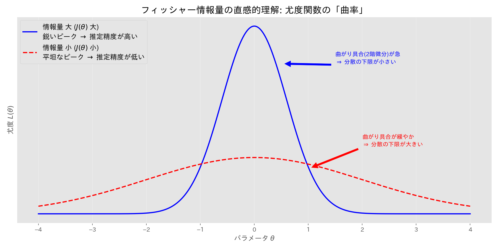

# 第８章　統計的推定の基礎

> [!IMPORTANT]
> **【準1級での学習深度と対策】**
> 点推定量の良さを評価する基準と、最尤法の計算手順が問われます。
>
> 1.  **推定量の望ましい性質**:
>     不偏性（期待値が真値）、一致性（極限が真値）、有効性（分散が最小）。これらの定義と判定方法をマスターしましょう。
> 2.  **最尤法 (MLE)（必須）**:
>     尤度関数 $L(\theta)$ を立て、対数をとり、微分して0とおく。この一連の流れは多様な分布（正規、ポアソン、指数など）で素早く行えるように。
> 3.  **クラメール・ラオの不等式**:
>     不偏推定量の分散の下限（公式）を計算し、有効推定量かどうかを判定する問題が出ます。フィッシャー情報量の計算もセットで覚えましょう。

## 1. 統計的推定の基礎概念

### 用語の定義
同一の分布 $f(x; \theta)$ に従う独立な標本 $X_1, \dots, X_n$ から、母数 $\theta$ を推測すること。
- **点推定**: 標本の関数 $h(X_1, \dots, X_n)$ で値を推定すること。
- **推定量 (Estimator)**: 推定に使う関数 $\hat{\theta} = h(X_1, \dots, X_n)$ そのもの。
- **推定値 (Estimate)**: 実際に観測値を代入して計算した値。
- **統計量**: 標本のみの関数（未知母数を含まない）。

### 順序統計量
標本の観測値を小さい順に並べ替えたもの。
$$
x_{(1)} \le x_{(2)} \le \dots \le x_{(n)}
$$
- $x_{(1)}$: 最小値, $x_{(n)}$: 最大値

## 2. 点推定の望ましい性質

良い推定量の基準です。

- **不偏性 (Unbiasedness)**: 期待値が真の値に一致する ($E[\hat{\theta}] = \theta$)。
- **一致性 (Consistency)**: $n \to \infty$ で真の値に確率収束する ($\hat{\theta} \xrightarrow{p} \theta$)。
- **有効性 (Efficiency)**: 不偏推定量の中で、分散 $V[\hat{\theta}]$ が最小であること。

## 3. 推定法

### (1) モーメント法
「標本モーメント ＝ 母モーメント」の方程式を解いて母数を推定する方法。
- **母モーメント**: $E[X^k] = h_k(\theta)$
- **標本モーメント**: $\frac{1}{n} \sum X_i^k$

> [!NOTE]
> **【例】二項分布 $Bin(n, p)$ のモーメント法**
> $E[X]=np, E[X^2]=np(1-p)+(np)^2$ と標本平均・分散を連立させて解きます。
> $$
> \hat{p} = 1 - \frac{S^2}{\bar{X}}, \quad \hat{n} = \frac{\bar{X}}{\hat{p}}
> $$

### (2) 最尤法 (Maximum Likelihood Estimation; MLE)
観測データが得られる確率（尤度）が最大になるように母数を決める方法。

**手順**:
1. **尤度関数**: $L(\theta) = \prod_{i=1}^n f(x_i; \theta)$ を作る。
2. **対数尤度**: $l(\theta) = \log L(\theta)$ をとる（計算しやすくするため）。
3. **最大化**: $\frac{\partial l}{\partial \theta} = 0$ を解く。

> [!TIP]
> **最尤推定量の不変性**:
> $\theta$ の最尤推定量が $\hat{\theta}$ ならば、関数 $g(\theta)$ の最尤推定量は $g(\hat{\theta})$ です。

> [!WARNING]
> **【CBT頻出の罠】正規分布の分散**
> - **最尤推定量**: $\hat{\sigma}^2 = \frac{1}{n} \sum (X_i - \bar{X})^2$ (偏りあり)
> - **不偏推定量**: $U^2 = \frac{1}{n-1} \sum (X_i - \bar{X})^2$ (不偏分散)
>
> 問題で「最尤推定量」と「不偏推定量」のどちらを問われているか注意してください。

## 4. 推定量の評価と詳細理論

### 平均二乗誤差 (MSE)
推定量の精度を表す指標。真の値からのズレの二乗平均であり、**「偏り（バイアス）」** と **「分散（バリアンス）」** に分解できます。

$$
MSE[\hat{\theta}] = E[(\hat{\theta} - \theta)^2] = \underbrace{V[\hat{\theta}]}_{\text{分散}} + \underbrace{(E[\hat{\theta}] - \theta)^2}_{\text{(バイアス)}^2}
$$

- **バイアス (Bias)**: 推定量の期待値が真の値からどれだけずれているか。 ($Bias[\hat{\theta}] = E[\hat{\theta}] - \theta$)
- **分散 (Variance)**: 推定量自体のバラつき。
- **トレードオフ**: 一般に、バイアスを減らそうとすると分散が増え、分散を減らそうとするとバイアスが増える傾向があります（バイアス・バリアンス・トレードオフ）。
  - 不偏推定量は Bias=0 なので $MSE = V[\hat{\theta}]$ となりますが、あえて少々のバイアスを許容することで分散を劇的に減らし、結果として MSE を小さくする推定量（縮小推定量など）も存在します。

### フィッシャー情報量とクラメール・ラオの下限
- **スコア関数 $U(\theta)$**: 対数尤度関数の微分。
  $$
  U(\theta) = \frac{\partial}{\partial \theta} \log L(\theta)
  $$
  - 重要性質: **期待値は常に0** ($E[U(\theta)] = 0$)。これが尤度方程式の解が極値であることの背景です。

- **フィッシャー情報量 $J_n(\theta)$**: データが母数について持っている情報量。
  定義（スコア関数の分散）と、計算用公式（2階微分）のどちらも重要です。
  $$
  J_n(\theta) = V[U(\theta)] = E[U(\theta)^2] = -E\left[\frac{\partial^2}{\partial \theta^2} \log L(\theta)\right]
  $$
  

- **クラメール・ラオの不等式**: 不偏推定量の分散には下限がある。
  $$
  V[\hat{\theta}] \ge \frac{1}{J_n(\theta)}
  $$

  この下限を達成する推定量を **有効推定量 (UMVUE)** と言います。

### その他の重要概念
- **漸近正規性**: $n$ が大きいとき、最尤推定量は近似的に正規分布に従う。
  $$
  \hat{\theta} \sim N(\theta, \frac{1}{J_n(\theta)})
  $$
- **十分統計量**: 母数 $\theta$ の情報を全て持っている統計量。
  $$
  L(\theta) = h(x) g(T(x); \theta) \implies T(x) \text{は十分統計量}
  $$
  > [!TIP]
  > **【準1級での学習深度：分解定理】**
  > 「フィッシャー・ネイマンの分解定理」を用いて、与えられた統計量が十分統計量かどうかを判定できることが求められます。
  > - $x$ だけの項 $h(x)$ と、統計量 $T(x)$ と $\theta$ の項 $g(T(x); \theta)$ に尤度関数を因数分解できればOKです。
  > - 例: 正規分布の $\bar{X}$ やポアソン分布の $\sum X_i$ などが十分統計量であることを示せるようにしましょう。
  >
  >   **【証明例1: ベルヌーイ分布 $Ber(p)$】**
  >   $$ L(p) = \underbrace{1}_{h(x)} \cdot \underbrace{p^{\sum x_i} (1-p)^{n-\sum x_i}}_{g(\sum x_i; p)} \implies \sum X_i \text{ は十分統計量} $$
  >
  >   **【証明例2: ポアソン分布 $Po(\lambda)$】**
  >   $$ L(\lambda) = \prod \frac{e^{-\lambda}\lambda^{x_i}}{x_i!} = \frac{e^{-n\lambda}\lambda^{\sum x_i}}{\prod x_i!} = \underbrace{\frac{1}{\prod x_i!}}_{h(x)} \cdot \underbrace{e^{-n\lambda}\lambda^{\sum x_i}}_{g(\sum x_i; \lambda)} \implies \sum X_i \text{ は十分統計量} $$
  >
  >   **【証明例3: 正規分布 $N(\mu, 1)$】** (分散既知の場合)
  >   $$ L(\mu) \propto \exp\left(-\frac{\sum(x_i-\mu)^2}{2}\right) = \exp\left(-\frac{\sum x_i^2 - 2\mu\sum x_i + n\mu^2}{2}\right) = \underbrace{\exp\left(-\frac{\sum x_i^2}{2}\right)}_{h(x)} \cdot \underbrace{\exp\left(\mu\sum x_i - \frac{n\mu^2}{2}\right)}_{g(\sum x_i; \mu)} $$
  >   $\sum X_i$ (または $\bar{X}$) は十分統計量。
- **ジャックナイフ法**: データを1つずつ抜いて推定量を計算し、バイアスを補正する手法。
  > [!TIP]
  > **【準1級での学習深度：ジャックナイフ法】**
  > 詳細な計算問題よりも、「手法の概要と目的」を問われる知識問題が主です。
  > - **目的**: 推定量のバイアス補正と分散推定。
  > - **特徴**: 全データから1つ除いた $n-1$ 個のデータで推定量を $n$ 回計算し、それらの平均を使って補正します（計算負荷が高い）。
  > - 近年はより計算負荷が高く汎用的な**ブートストラップ法**（復元抽出による分散推定）も選択肢として並ぶことがあります。

