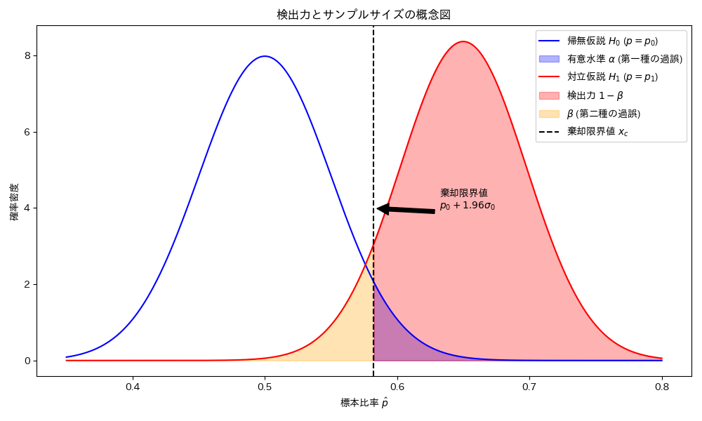

# 第10章　検定の基礎と検定法の導出

> [!IMPORTANT]
> **【準1級での学習深度と対策】**
> 「P値が0.05以下だから有意」という手順だけでなく、検定統計量の導出原理（ネイマン・ピアソン、尤度比）を理論的に理解する必要があります。
>
> 1.  **第1種・第2種の過誤と検出力**:
>     $\alpha$（生産者リスク）と $\beta$（消費者リスク）、そして検出力 $1-\beta$ の関係をグラフでイメージできるように。検出力を計算させる問題も出ます。
> 2.  **ネイマン・ピアソンの基本定理**:
>     単純仮説において「尤度比検定が最強力検定になる」という定理。具体的な問題で棄却域を導出できるレベルを目指しましょう。
> 3.  **尤度比検定**:
>     一般の検定において、尤度比 $\lambda$ を用いて検定統計量を構成し、それが漸近的にカイ二乗分布に従う（ウィルクスの定理）ことを押さえましょう。

## 1. 検定の基本用語

母数に関する２つの仮説のうち，データによって支持されるものを選ぶ手法を**統計的仮説検定**といいます。

- **帰無仮説 ($H_0$)**: 否定（棄却）することを目的として立てる仮説。「差がない」「効果がない」など。
- **対立仮説 ($H_1$)**: 帰無仮説が棄却されたときに採択される仮説。「差がある」「効果がある」など。
- **有意水準 ($\alpha$)**: 帰無仮説が正しいのに誤って棄却してしまう確率の許容限界。通常 5% ($0.05$) や 1% ($0.01$) を用いる。
- **P値 (p-value)**: 帰無仮説のもとで、得られた検定統計量（またはそれより極端な値）が観測される確率。$P < \alpha$ ならば有意と判定する。
- **第一種の過誤 ($\alpha$)**: 帰無仮説が正しいのに棄却する誤り（あわてものの誤り）。確率は有意水準に等しい。
- **第二種の過誤 ($\beta$)**: 帰無仮説が誤りなのに受容する誤り（ぼんやりものの誤り）。$1-\beta$ を**検出力**という。

## 2. 検出力とサンプルサイズ

### 検出力の概念
有意水準 $\alpha$、検出力 $1-\beta$、サンプルサイズ $n$ の関係を理解することは重要です。
以下の図は、帰無仮説 $H_0: p=p_0$ と 対立仮説 $H_1: p=p_1 (p_1 > p_0)$ の分布の関係を示しています。

- **青色の分布 ($H_0$)**: 帰無仮説が正しい場合の分布。右裾の面積が有意水準 $\alpha$ です。
- **赤色の分布 ($H_1$)**: 対立仮説が正しい場合の分布。
    - **検出力 ($1-\beta$)**: 赤色の領域。対立仮説が正しいときに、正しく $H_0$ を棄却できる確率。
    - **$\beta$ (第二種の過誤)**: 黄色の領域。対立仮説が正しいのに、$H_0$ を棄却できない確率。

### 必要なサンプルサイズの導出
棄却限界値（黒い点線）を基準に、2つの分布における距離を考えることで、必要なサンプルサイズ $n$ を求める式が導けます。

1. **帰無仮説 $H_0$ 側からの距離**:
   棄却限界値は、平均 $p_0$ から標準偏差の $z_{\alpha}$ 倍（有意水準5%片側なら1.645倍、2.5%なら1.96倍）離れています。
   $$
   x_c = p_0 + z_{\alpha} \sqrt{\frac{p_0(1-p_0)}{n}}
   $$

2. **対立仮説 $H_1$ 側からの距離**:
   同じ棄却限界値は、対立仮説の平均 $p_1$ から標準偏差の $z_{\beta}$ 倍（検出力に対応する係数）離れています。
   $$
   x_c = p_1 - z_{\beta} \sqrt{\frac{p_1(1-p_1)}{n}}
   $$

3. **式の結合と変形**:
   2つの式から $x_c$ を消去して整理すると、平均の差と標準偏差の和の関係式が得られます。
   $$
   p_1 - p_0 = z_{\alpha} \sqrt{\frac{p_0(1-p_0)}{n}} + z_{\beta} \sqrt{\frac{p_1(1-p_1)}{n}}
   $$

   これを $n$ について解くことで、所望の検出力を得るために必要なサンプルサイズを計算できます。

### エフェクトサイズ (効果量)
2つの分布の平均の差を標準偏差単位で測ったもの。
$$
\text{Effect Size} = \frac{|\mu_1 - \mu_0|}{\sigma} \approx \frac{z_{\alpha} + z_{\beta}}{\sqrt{n}}
$$
- エフェクトサイズが大きいほど、2つの分布は離れており、小さなサンプルサイズでも検出力が高くなります。

### 生産者危険と消費者危険 (抜取検査の用語)
抜取検査（品質管理）の分野では、第一種の過誤・第二種の過誤を次のように呼びます。
不良品の個数 $X$ は、サンプルサイズ $n$、不良率 $p$ の**二項分布 $Bin(n, p)$** に従います。

- **生産者危険 (第一種の過誤 $\alpha$)**:
  実際には合格品質（$p=p_0$）であるにもかかわらず、運悪く不良品が多く検出されて不合格としてしまう確率。生産者が被るリスクです。
  不合格となるのは不良品数 $X$ が基準値 $c$ を**超える**（$c+1$ 個以上）場合なので、その確率の和となります。
  $$
  P(X > c | p=p_0) = \sum_{k=c+1}^n {}_nC_k p_0^k (1-p_0)^{n-k}
  $$

- **消費者危険 (第二種の過誤 $\beta$)**:
  実際には不合格品質（$p=p_1$）であるにもかかわらず、運悪く不良品が少なく検出されて合格としてしまう確率。消費者が不良品をつかまされるリスクです。
  合格となるのは不良品数 $X$ が基準値 $c$ **以下**（$0$ から $c$ 個）の場合なので、その確率の和となります。
  $$
  P(X \le c | p=p_1) = \sum_{k=0}^c {}_nC_k p_1^k (1-p_1)^{n-k}
  $$

## 3. 検定法の導出（準1級重要項目）

> [!IMPORTANT]
> **【準1級：暗記と理解の使い分け】**
> 全ての数式の完ぺきな丸暗記は不要です。以下のようにメリハリをつけて学習してください。
>
> 1. **暗記必須**:
>    - **ウィルクスの定理**: $-2 \log \lambda \xrightarrow{d} \chi^2(df)$ という式と、自由度の意味。これは頻出です。
>    - **ネイマン・ピアソンの補題**: 「単純仮説において尤度比検定が最強力検定である」という事実（言葉での暗記）。
>
> 2. **概念理解・判別レベルでOK**:
>    - **ワルド検定**: 「推定値と仮説値の**距離**」に基づく検定だということ。
>    - **スコア検定**: 「対数尤度の**傾き（スコア）**」に基づく検定だということ。
>    - ※ワルド検定・スコア検定の数式をゼロから書かせる問題は稀ですが、**提示された数式を見てどの検定か判別できる**レベルにはしておきましょう。

### ネイマン・ピアソンの補題 (Neyman-Pearson Lemma)
単純帰無仮説 $H_0: \theta = \theta_0$ 対 単純対立仮説 $H_1: \theta = \theta_1$ の検定において、有意水準 $\alpha$ を固定したとき、**尤度比**に基づく検定が最も高い検出力（最強力検定）を与えるという定理。

$$
\lambda(x) = \frac{L(\theta_1; x)}{L(\theta_0; x)} > k \iff \text{Reject } H_0
$$

### 尤度比検定 (Likelihood Ratio Test)
一般の仮説検定において、帰無仮説空間 $\Theta_0$ と全空間 $\Theta$ での最大尤度の比 $\lambda$ を用いる方法。

$$
\lambda(x) = \frac{\sup_{\theta \in \Theta_0} L(\theta; x)}{\sup_{\theta \in \Theta} L(\theta; x)}
$$

サンプルサイズ $n$ が大きいとき、$-2 \log \lambda$ は近似的にカイ二乗分布に従います（ウィルクスの定理）。**これは非常に重要です。**

$$
-2 \log \lambda \xrightarrow{d} \chi^2(df)
$$
($df$ は制約条件の数、つまりパラメータ空間の次元の差)

> [!TIP]
> **自由度 $df$ の数え方（具体例）**
> 正規分布 $N(\mu, \sigma^2)$ における検定 $H_0: \mu = 0$ vs $H_1: \mu \neq 0$ を考えます。
>
> 1. **全パラメータ空間 $\Theta$**:
>    制約なし。パラメータは $(\mu, \sigma^2)$ の **2つ**。よって次元は $\dim(\Theta) = 2$。
> 2. **帰無仮説の空間 $\Theta_0$**:
>    $\mu=0$ という制約がかかります。自由に動けるパラメータは $\sigma^2$ だけの **1つ**。よって次元は $\dim(\Theta_0) = 1$。
> 3. **自由度 $df$**:
>    $df = \dim(\Theta) - \dim(\Theta_0) = 2 - 1 = 1$。
>
> 「制約条件の数」（今回は $\mu=0$ という式が1本）と考えても同じ結果になります。試験では**「制約式の本数」**と数えるのが最も手っ取り早いです。

### ワルド検定 (Wald Test)
最尤推定量 $\hat{\theta}_{MLE}$ の漸近正規性を利用する検定。帰無仮説値 $\theta_0$ と推定値 $\hat{\theta}$ の距離を、推定量の標準誤差（フィッシャー情報量の逆数）で評価します。

$$
W = (\hat{\theta} - \theta_0)^2 I(\hat{\theta}) \xrightarrow{d} \chi^2(1)
$$

計算が簡単（ $H_0$ 下での再計算が不要）ですが、サンプルサイズが小さいと近似精度が悪いことがあります。

### スコア検定 (Score Test) / ラグランジュ乗数検定
対数尤度関数の微分（スコア関数） $S(\theta) = \frac{\partial}{\partial \theta} \log L(\theta)$ を用いる検定。帰無仮説値 $\theta_0$ でのスコアの大きさを評価します。

$$
S = \frac{S(\theta_0)^2}{I(\theta_0)} \xrightarrow{d} \chi^2(1)
$$

$H_0$ が正しいならスコア（傾き）は 0 に近いはず、という考え方に基づきます。$\hat{\theta}_{MLE}$ を計算せずに済む利点があります。

> [!TIP]
> **検定統計量の関係**
> 一般に、有限標本では検定結果は異なりますが、漸近的（$n \to \infty$）には以下の関係があります。
> **Wald検定 $\approx$ 尤度比検定 $\approx$ スコア検定**
