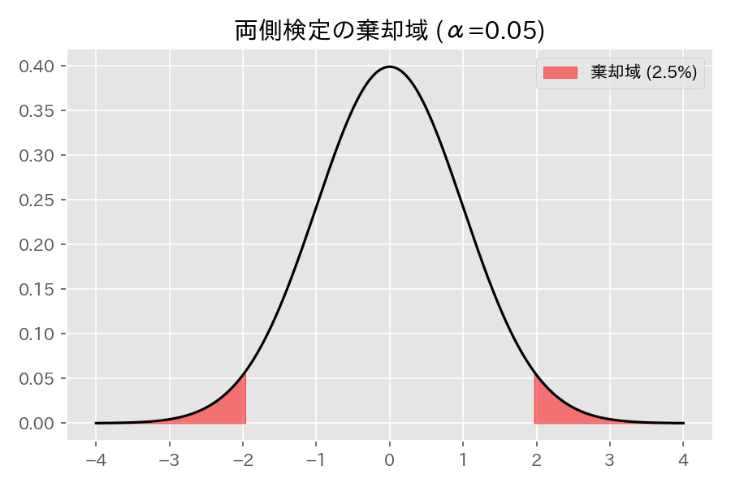

# 第１１章　正規分布に関する検定

> [!IMPORTANT]
> **【準1級での学習深度と対策】**
> 正規分布に基づく基本的な検定手法（Z検定、t検定、$\chi^2$検定、F検定）の使い分けが最重要です。
>
> 1.  **検定統計量の使い分け（必須）**:
>     -   母平均の検定：母分散既知ならZ、未知ならt。
>     -   2標本の平均差：等分散ならプールした分散のt、異分散ならウェルチのt。
>     -   母分散の検定：1標本なら$\chi^2$、2標本（比）ならF。
>     このフローチャートを瞬時に脳内で描けるようにしましょう。
> 2.  **ウェルチのt検定**:
>     実務でも多用される重要な検定です。自由度の近似式自体を暗記する必要は薄いですが（試験では整数近似などを指示されることが多い）、概念と適用場面は理解してください。
> 3.  **対応のある/なし**:
>     「対応のある2標本」は差をとって「1標本」に帰着させるという考え方を定着させましょう。

## 1. 母平均の検定 (1標本)

母集団分布 $N(\mu, \sigma^2)$ を仮定します。帰無仮説は $H_0: \mu = \mu_0$ です。

### (1) 母分散 $\sigma^2$ が既知の場合 (Z検定)
検定統計量 $Z$ は標準正規分布 $N(0,1)$ に従います。

$$
Z = \frac{\bar{X} - \mu_0}{\sigma/\sqrt{n}}
$$

### (2) 母分散 $\sigma^2$ が未知の場合 (t検定)
母分散の代わりに不偏分散 $U^2 = \frac{1}{n-1}\sum(X_i-\bar{X})^2$ を用います。
検定統計量 $T$ は自由度 $n-1$ のt分布に従います。

$$
T = \frac{\bar{X} - \mu_0}{U/\sqrt{n}}
$$

> [!TIP]
> **【準1級合格のポイント：Z検定とt検定】**
> - **試験での判断基準**: 「母分散既知」ならZ検定、「未知」ならt検定です。実務・試験ともに9割以上は**t検定**を使います。
> - **自由度**: $n-1$ です。「平均 $\bar{X}$ を決めるためにデータが1つ消費された」とイメージしましょう。
> - **大標本**: $n$ が十分大きい（概ね30以上）場合、t分布は正規分布に近似するため、Z検定で代用しても許容されます。

## 2. 母分散の検定 (1標本)
母集団分布 $N(\mu, \sigma^2)$ を仮定します。帰無仮説は $H_0: \sigma^2 = \sigma_0^2$ です。
検定統計量 $\chi^2$ は自由度 $n-1$ のカイ二乗分布に従います。

$$
\chi^2 = \frac{(n-1)U^2}{\sigma_0^2}
$$

> [!TIP]
> **【準1級合格のポイント：カイ二乗分布のイメージ】**
> - **式変形**: 分子は偏差平方和 $S = \sum(X_i-\bar{X})^2$ そのものです。つまり $\chi^2 = S / \sigma_0^2$ とも書けます。
> - **片側検定**: 「分散が基準より大きいか？」を調べる場合が多いです（品質管理でのバラつき増大の検知など）。

## 3. 母平均の差の検定 (2標本)
2つの独立な母集団 $N(\mu_1, \sigma_1^2), N(\mu_2, \sigma_2^2)$ を仮定します。帰無仮説は $H_0: \mu_1 = \mu_2$ です。

### (1) 母分散が既知の場合
検定統計量 $Z$ は標準正規分布に従います。

$$
Z = \frac{\bar{X}_1 - \bar{X}_2}{\sqrt{\frac{\sigma_1^2}{n_1} + \frac{\sigma_2^2}{n_2}}}
$$

### (2) 母分散が未知だが等しいと仮定できる場合 ($\sigma_1^2 = \sigma_2^2 = \sigma^2$)
合併した分散 (pooled variance) $U_p^2$ を用います。

$$
U_p^2 = \frac{(n_1-1)U_1^2 + (n_2-1)U_2^2}{n_1+n_2-2}
$$

検定統計量 $T$ は自由度 $n_1+n_2-2$ のt分布に従います。

$$
T = \frac{\bar{X}_1 - \bar{X}_2}{U_p \sqrt{\frac{1}{n_1} + \frac{1}{n_2}}}
$$

> [!TIP]
> **【準1級合格のポイント：プーリングの直感】**
> $U_p^2$ は、2つの不偏分散を自由度（サンプルサイズ-1）で重みづけ平均したものです。2つのグループのバラつきが同じという仮定のもと、データを合算してより精度の高い分散推定を行う操作です。

### (3) 母分散が等しいとは限らない場合 (ウェルチのt検定)
検定統計量 $T$ は近似的に自由度 $\nu$ のt分布に従います（ウェルチの近似）。

$$
T = \frac{\bar{X}_1 - \bar{X}_2}{\sqrt{\frac{U_1^2}{n_1} + \frac{U_2^2}{n_2}}}
$$

自由度 $\nu$ の近似式（サタスウェイトの式）：
$$
\nu \approx \frac{(\frac{U_1^2}{n_1} + \frac{U_2^2}{n_2})^2}{\frac{(U_1^2/n_1)^2}{n_1-1} + \frac{(U_2^2/n_2)^2}{n_2-1}}
$$
※試験では「自由度は最も近い整数を用いよ」という指示が出ることが多いです。

## 4. 母分散の比の検定 (等分散性の検定)
2つの独立な母集団を仮定します。帰無仮説は $H_0: \sigma_1^2 = \sigma_2^2$ です。
検定統計量 $F$ は自由度 $(n_1-1, n_2-1)$ のF分布に従います。

$$
F = \frac{U_1^2}{U_2^2}
$$

> [!TIP]
> **【準1級合格のポイント：F検定の棄却域設定】**
> 通常、F分布表は右側確率（上側確率）しか掲載されていません。
> そのため、検定統計量を計算する際は **「大きい方の不偏分散」を分子** に置きます（$F > 1$ にする）。
> こうすることで、必ず分布の右裾で検定を行うことができ、表がそのまま使えます。

## 5. 対応のある2標本の平均の検定
同一の対象に対して 処理前・処理後などでペアとなるデータ $(X_{i1}, X_{i2})$ が得られる場合です。
差 $D_i = X_{i1} - X_{i2}$ をとり、その差が母平均 0 の正規分布に従うかを検定します（1標本のt検定に帰着します）。

$$
T = \frac{\bar{D}}{U_D / \sqrt{n}}
$$
($\bar{D}$ は差の平均、$U_D$ は差の不偏標準偏差)

## 6. 検定統計量公式まとめ（試験直前チェック用）

| 推定対象 | 条件 | 分布・自由度 | 統計量 (分母部分) | 備考 |
| :--- | :--- | :--- | :--- | :--- |
| **母平均** $\mu$ | 分散既知 | $N(0, 1)$ | $\sigma / \sqrt{n}$ | 基本形 |
| **母平均** $\mu$ | 分散未知 | $t(n-1)$ | $U / \sqrt{n}$ | 最頻出 |
| **平均差** $\mu_1-\mu_2$ | 等分散 | $t(n_1+n_2-2)$ | $U_p \sqrt{1/n_1 + 1/n_2}$ | プールした分散使用 |
| **平均差** $\mu_1-\mu_2$ | 異分散 | $t(\nu^*)$ | $\sqrt{U_1^2/n_1 + U_2^2/n_2}$ | ウェルチの近似 |
| **平均差** $\mu_d$ | 対応あり | $t(n-1)$ | $U_D / \sqrt{n}$ | 差をとって1標本化 |
| **母分散** $\sigma^2$ | - | $\chi^2(n-1)$ | $(n-1)U^2 / \sigma_0^2$ (全体) | 片側検定が多い |
| **分散比** $\sigma_1^2/\sigma_2^2$ | - | $F(n_1-1, n_2-1)$ | $U_1^2/U_2^2$ (全体) | 大きい分散を分子に |

