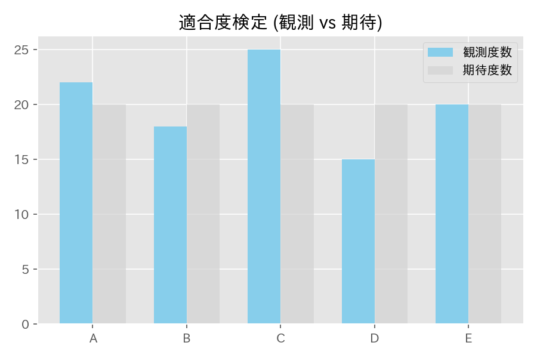

# 第12章　一般の分布に関する検定法

> [!IMPORTANT]
> **【準1級での学習深度と対策】**
> カテゴリカルデータ解析の基礎となる「カイ二乗検定」がメインです。自由度の計算ミスに注意しましょう。
>
> 1.  **適合度検定の自由度（必須）**:
>     通常は $k-1$ ですが、パラメータを推定して当てはめる場合（例：ポアソン分布のパラメータを $\bar{x}$ で推定）は $k-1-m$ （$m$: パラメータ数）となります。これを忘れると失点します。
> 2.  **独立性の検定**:
>     分割表における期待度数 $E_{ij} = \frac{n_{i \cdot} n_{\cdot j}}{n}$ の計算と、カイ二乗統計量の導出プロセスを確実に。
> 3.  **尤度比検定**:
>     $-2 \log \lambda$ が近似的にカイ二乗分布に従う（ウィルクスの定理）ことの意味と、自由度（パラメータ空間の次元の差）の考え方を理解しましょう。

## 1. 母比率の検定 (1標本)
母比率 $p$ に関する検定。帰無仮説 $H_0: p = p_0$。
サンプルサイズ $n$ が十分に大きいとき、近似的に正規分布を用います（Z検定）。

$$
Z = \frac{\hat{p} - p_0}{\sqrt{\frac{p_0(1-p_0)}{n}}}
$$
($\hat{p} = X/n$ は標本比率)

## 2. 母比率の差の検定 (2標本)
2つの母比率 $p_1, p_2$ に関する検定。帰無仮説 $H_0: p_1 = p_2$。
帰無仮説の下では $p_1 = p_2 = p$ となるため、まず合併比率 $\hat{p}$ を計算します。

$$
\hat{p} = \frac{X_1 + X_2}{n_1 + n_2} = \frac{n_1 \hat{p}_1 + n_2 \hat{p}_2}{n_1 + n_2}
$$

検定統計量 $Z$ は近似的に標準正規分布に従います。

$$
Z = \frac{\hat{p}_1 - \hat{p}_2}{\sqrt{\hat{p}(1-\hat{p})(\frac{1}{n_1} + \frac{1}{n_2})}}
$$

## 3. ポアソン分布に関する検定
平均 $\lambda$ のポアソン分布 $Po(\lambda)$ に関する検定。帰無仮説 $H_0: \lambda = \lambda_0$。
$\lambda$ が大きいとき、$Po(\lambda) \approx N(\lambda, \lambda)$ と近似できることを利用します。

$$
Z = \frac{\bar{X}-\lambda_0}{\sqrt{\lambda_0/n}} \sim N(0, 1)
$$
（注：分散も平均と同じ $\lambda$ になる点に注意）

## 4. 適合度検定 (Goodness-of-Fit Test)
観測された度数分布が、理論的な確率分布（期待度数）に当てはまっているかを検定します。
観測度数を $x_i$、期待度数を $E_i = np_i$ とします（カテゴリ数 $k$）。

$$
\chi^2 = \sum_{i=1}^k \frac{(x_i - E_i)^2}{E_i} = \sum_{i=1}^k \frac{(x_i - np_i)^2}{np_i}
$$

この統計量は、近似的に **カイ二乗分布 $\chi^2(df)$** に従います。

> [!IMPORTANT]
> **自由度 $df$ の決定ルール（重要）**
> 1. **単純な適合度検定**:
>    パラメータをデータから推定せず、理論分布が完全に既知の場合。
>    $$
>    df = k - 1
>    $$
>    （カテゴリ数 - 1）
>
> 2. **パラメータ推定を伴う場合**:
>    理論分布のパラメータ（$\ell$個）をデータから最尤推定して期待度数を計算する場合。
>    $$
>    df = k - 1 - \ell
>    $$
>    例：正規分布への適合度検定（平均と分散の2つを推定）なら $df = k - 1 - 2 = k - 3$。

> [!NOTE]
> **イエーツの補正 (Yates' Correction)**
> 期待度数が小さい場合（目安として5未満）、近似精度が悪くなるため、以下の補正を行うことがあります（特に自由度1の場合）。
> $$
> \chi^2 = \sum \frac{(|x_i - E_i| - 0.5)^2}{E_i}
> $$
> 検定統計量が小さくなり、帰無仮説を棄却しにくくなる（保守的になる）効果があります。

## 5. 尤度比検定 (Likelihood Ratio Test)
より一般的な検定の枠組みです。
帰無仮説 $H_0$（制約あり）と対立仮説 $H_1$（制約なし・全パラメータ空間）での最大尤度の比 $\lambda$ を考えます。

$$
\lambda = \frac{L(\hat{\theta}_{H_0})}{L(\hat{\theta}_{H_1})}
$$

ここで、$-2 \log \lambda$ は近似的にカイ二乗分布に従います（**ウィルクスの定理**）。

$$
-2 \log \lambda \xrightarrow{d} \chi^2(df)
$$
自由度 $df$ は、制約条件の数（パラメータの次元の差）です。
[第10章 検定の基礎](?note=10_検定の基礎と検定法の導出) の内容とリンクさせて理解しておきましょう。
※具体的な計算例は [第28章 分割表](?note=28_分割表) で扱います（G検定など）。
