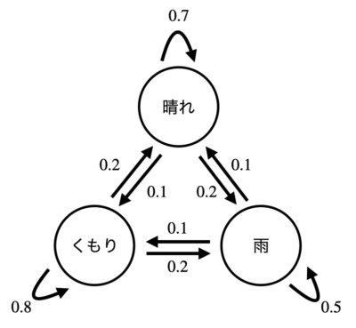
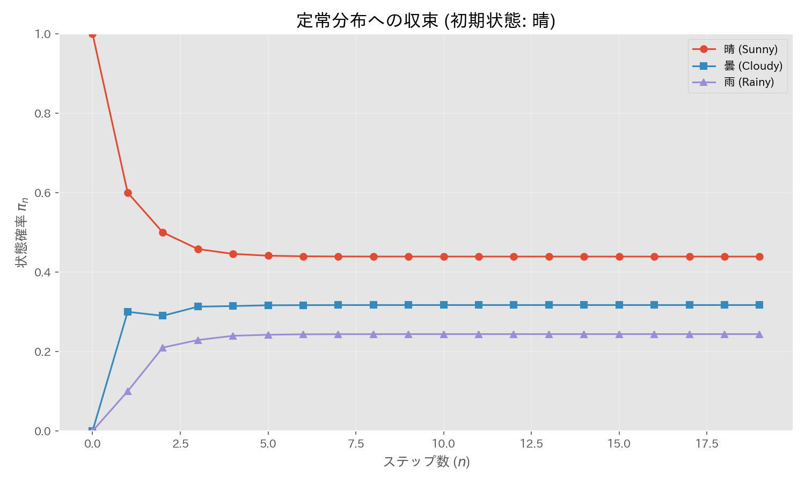

# 第14章　マルコフ連鎖

> [!IMPORTANT]
> **【準1級での学習深度と対策】**
> 行列計算と連立方程式を解く力が問われます。「定常分布」の導出は計算問題の鉄板です。
>
> 1.  **定常分布の導出（必須）**:
>     $\pi P = \pi$ および $\sum \pi_i = 1$ を連立させて解く手順は、2状態・3状態ともに必ずできるように。
> 2.  **推移確率行列の性質**:
>     各行の和が1になることや、$n$ ステップ後の推移確率が $P^n$ で表されることを理解しましょう。
> 3.  **分解可能性と周期性**:
>     状態遷移図を描いて、クラス分け（再帰性・吸収性）や周期性を判定する問題も出ます。

## 1. マルコフ連鎖の定義
離散的な状態空間 $S = \{1, 2, \dots, N\}$ をとる確率変数 $X_0, X_1, X_2, \dots$ が、以下の**マルコフ性（無記憶性）**を満たすとき、これをマルコフ連鎖と言います。

$$
P(X_{n+1}=j | X_n=i, X_{n-1}=i_{n-1}, \dots, X_0=i_0) = P(X_{n+1}=j | X_n=i)
$$

つまり、「未来の状態は、現在の状態によってのみ決まり、過去の履歴には依存しない」という性質です。

## 2. 推移確率行列と状態分布

### 推移確率行列 (Transition Probability Matrix)
状態 $i$ から状態 $j$ へ遷移する確率を $p_{ij} = P(X_{n+1}=j | X_n=i)$ としたとき、これらを並べた $N \times N$ 行列 $Q$ を推移確率行列と言います。

$$
Q = \begin{pmatrix}
p_{11} & p_{12} & \dots & p_{1N} \\
p_{21} & p_{22} & \dots & p_{2N} \\
\vdots & \vdots & \ddots & \vdots \\
p_{N1} & p_{N2} & \dots & p_{NN}
\end{pmatrix}
$$

行列の各行の和は必ず1になります（$\sum_{j} p_{ij} = 1$）。

### 状態確率ベクトル
時点 $n$ において各状態にいる確率を並べたベクトルを $\pi_n = (p_n(1), \dots, p_n(N))$ とします。
推移確率行列 $Q$ を用いると、次の時点の状態確率は以下のように更新されます。

$$
\pi_{n+1} = \pi_n Q
$$

したがって、初期分布 $\pi_0$ が与えられれば、時点 $n$ の分布は $\pi_n = \pi_0 Q^n$ で求まります。

## 3. 定常分布 (Stationary Distribution)
時間が十分に経過した後に収束する確率分布 $\pi$ のこと。
次の条件を満たす確率ベクトルです。

$$
\pi = \pi Q
$$

（$\pi$ は行列 $Q$ の固有値 1 に対する左固有ベクトル（を正規化したもの）に相当します）
マルコフ連鎖が「エルゴード性（正再帰的かつ非周期的）」など特定の条件を満たすとき、唯一の定常分布が存在します。

> [!TIP]
> **【準1級合格のポイント：定常分布の計算】**
> $\pi Q = \pi$ を成分で書くと、未知数 $N$ 個（$\pi_1, \dots, \pi_N$）に対して式が $N$ 本できますが、実はそのうち1本は他の式から導ける（線型従属な）冗長な式です。
> 代わりに、必ず成り立つ確率の和の条件 **$\sum_{i=1}^N \pi_i = 1$** を $N$ 本目の式として使って連立方程式を解いてください。これが最短ルートです。

## 4. 吸収壁と吸収確率
一度到達すると二度と他の状態へ遷移しない状態がある場合（$p_{ii}=1$）、その状態を**吸収壁 (Absorbing State)** と呼びます。
ある状態から出発して、特定の吸収状態に吸収される確率 $u_i$ を求めるには、次のような連立方程式を立てます（**第一段階分析**）。

$$
u_i = \sum_{j} p_{ij} u_j
$$
- 吸収状態 $k$ については $u_k = 1$。
- 他の吸収状態については $u = 0$。

> [!TIP]
> **【例題】ギャンブラーの破産問題**
> 所持金 $i$ 円からスタートし、勝率 $p$ で $+1$、敗率 $q$ で $-1$ となるゲーム（$0$ と $N$ が吸収壁）。
> 破産確率 $u_i$（0に吸収される確率）は、漸化式 $u_i = p u_{i+1} + q u_{i-1}$ を解くことで求まります。
> $p=q=1/2$ なら $u_i = 1 - i/N$（所持金比率に応じて安全になる）。

## 4. パラメータの推定
推移確率行列の要素が未知パラメータ $\theta$ を含む場合、観測データ列 $x_0, x_1, \dots, x_n$ から最尤推定を行います。

尤度関数 $L(\theta)$ は、条件付き確率の積に分解できます（マルコフ性より）。

$$
L(\theta) = P(X_0=x_0) \prod_{k=0}^{n-1} P(X_{k+1}=x_{k+1} | X_k=x_k)
$$

対数尤度 $\log L(\theta)$ を最大化する $\theta$ を求めます。

> [!NOTE]
> **頻度による推定**
> 単純な推移確率 $p_{ij}$ の推定値は、状態 $i$ から $j$ へ遷移した回数を $n_{ij}$、状態 $i$ から出発した総回数を $n_i$ として、$\hat{p}_{ij} = n_{ij} / n_i$ となります。

