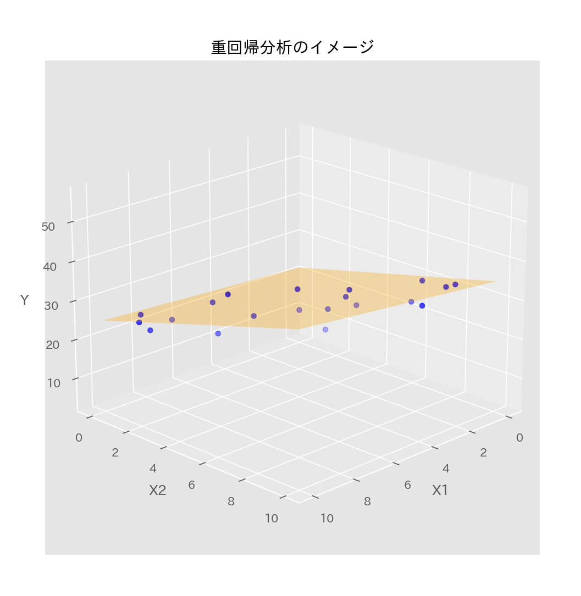
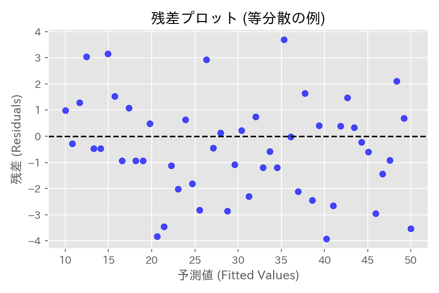
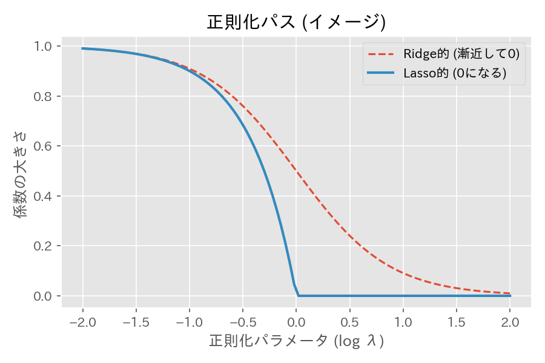

# 第16章　重回帰分析

> [!IMPORTANT]
> **【準1級での学習深度と対策】**
> 重回帰分析は最も応用範囲が広い分野です。出力結果（係数、P値、決定係数）を正確に読み取る力が試されます。
>
> 1.  **係数の有意性とモデルの有意性**:
>     各係数のt検定と、モデル全体のF検定の違いを理解してください。「モデル全体は有意だが、個々の係数は有意でない」状態（多重共線性）の理解も重要です。
> 2.  **決定係数と自由度調整**:
>     単なる $R^2$ は変数が増えると必ず増加するため、実用上は「自由度調整済み決定係数」を使う理由を説明できるように。
> 3.  **多重共線性 (MultiCo)**:
>     VIF（分散拡大要因）などの指標でマルチコを検出し、その悪影響（推定値の分散増大）を理解しておくこと。

## 1. 重回帰モデルの定義
目的変数 $y$ を複数の説明変数 $x_1, \dots, x_d$ で説明するモデル。

$$
y = X\beta + \epsilon
$$

- $\mathbf{y}$: 観測値ベクトル $(n \times 1)$
- $X$: 説明変数行列（デザイン行列） $(n \times (d+1))$、先頭列は全て1（切片項）。
- $\boldsymbol{\beta}$: 回帰係数ベクトル $((d+1) \times 1)$
- $\boldsymbol{\epsilon}$: 誤差ベクトル $(n \times 1)$

$$
\begin{pmatrix} y_1 \\ \vdots \\ y_n \end{pmatrix} = \begin{pmatrix} 1 & x_{11} & \dots & x_{1d} \\ \vdots & \vdots & \ddots & \vdots \\ 1 & x_{n1} & \dots & x_{nd} \end{pmatrix} \begin{pmatrix} \beta_0 \\ \vdots \\ \beta_d \end{pmatrix} + \begin{pmatrix} \epsilon_1 \\ \vdots \\ \epsilon_n \end{pmatrix}
$$

## 2. 最小二乗法 (Ordinary Least Squares; OLS)

### 推定量と性質
残差平方和 $S_e = \|\mathbf{y} - X\boldsymbol{\beta}\|^2$ を最小化する推定量 $\hat{\boldsymbol{\beta}}$。

$$
\hat{\boldsymbol{\beta}} = (X^T X)^{-1} X^T \mathbf{y}
$$

- **ガウス・マルコフの定理**: 誤差項が不偏 ($E[\epsilon]=0$) かつ等分散 ($V[\epsilon]=\sigma^2 I$) ならば、OLS推定量は**最良線形不偏推定量 (BLUE)** となる。
- **分散共分散行列**: $V[\hat{\boldsymbol{\beta}}] = \sigma^2 (X^T X)^{-1}$

### 予測値と残差
- **予測値**: $\hat{\mathbf{y}} = X\hat{\boldsymbol{\beta}} = H \mathbf{y}$
  - $H = X(X^T X)^{-1} X^T$: ハット行列（射影行列）
- **残差**: $\mathbf{e} = \mathbf{y} - \hat{\mathbf{y}} = (I - H) \mathbf{y}$
- **誤差分散の推定**: $\hat{\sigma}^2 = \frac{\|\mathbf{e}\|^2}{n-d-1}$ (不偏推定量)

## 3. モデルの当てはまりと検定

### 決定係数 (Coefficient of Determination)
モデルの当てはまりの良さを表す指標。
$$
R^2 = 1 - \frac{\sum (y_i - \hat{y}_i)^2}{\sum (y_i - \bar{y})^2}
$$
- $0 \le R^2 \le 1$
- **欠点**: 説明変数を増やすと単調に増加するため、過学習のリスクがある。

### 自由度調整済み決定係数 (Adjusted $R^2$)
自由度でペナルティをかけた指標。説明変数の追加に対する評価が厳しい。
$$
R^{*2} = 1 - \frac{\sum (y_i - \hat{y}_i)^2 / (n-d-1)}{\sum (y_i - \bar{y})^2 / (n-1)}
$$

### 係数の検定 (t検定・F検定)
$\epsilon \sim N(0, \sigma^2 I)$ を仮定する場合。
- **個別の係数**: $\hat{\beta}_j$ の有意性は **t検定** ($df=n-d-1$)。
  検定統計量 $T$ は、推定量 $\hat{\beta}_j$ とその標準誤差 $SE(\hat{\beta}_j)$ を用いて次のように表されます。
  $$
  T = \frac{\hat{\beta}_j - 0}{SE(\hat{\beta}_j)}
  $$
- **モデル全体**: 全ての係数が0 ($\beta_1 = \dots = \beta_d = 0$) かどうかの検定は **F検定**。
  $$
  F = \frac{\sum (\hat{y}_i - \bar{y})^2 / d}{\sum (y_i - \hat{y}_i)^2 / (n-d-1)} \sim F(d, n-d-1)
  $$

## 4. 正則化回帰 (Regularized Regression)
過学習を防ぐため、回帰係数の大きさにペナルティを課す手法。

### リッジ回帰 (Ridge / L2正則化)
係数の二乗和（L2ノルム）を罰則項に追加。
$$
L(\beta) + \lambda \sum \beta_j^2
$$
- 特徴: 係数を0に近づける（縮小推定）が、完全には0にしない。
- 多重共線性への対処に有効。

### Lasso回帰 (Lasso / L1正則化)
係数の絶対値和（L1ノルム）を罰則項に追加。
$$
L(\beta) + \lambda \sum |\beta_j|
$$
- 特徴: **スパース推定**（一部の係数を完全に0にする）。変数選択の効果がある。

### Elastic Net
L1とL2を組み合わせた手法。変数選択と係数の安定化を両立。
- **Fused Lasso**: 隣接する係数の差 $|\beta_j - \beta_{j-1}|$ に罰則をかけ、変化を滑らかにする。
- **Group Lasso**: 変数をグループ化し、グループ単位で「採用か、全係数0か」を選択する。$\sum_{g} \sqrt{\sum_{j \in g} \beta_j^2}$ のような罰則項を用いる。

### 正則化比較まとめ

| 手法 | 罰則項 | 特徴 | 用途 |
| :--- | :--- | :--- | :--- |
| **Ridge** | $\lambda \sum \beta_j^2$ (L2) | 係数全体を縮小 | 多重共線性対策、予測精度重視 |
| **Lasso** | $\lambda \sum \vert \beta_j \vert$ (L1) | 係数を0にする (スパース) | 変数選択、解釈性重視 |
| **Elastic Net** | L1 + L2 | 両者のいいとこ取り | 変数間相関が強い場合 |

> [!NOTE]
> **正則化パス (Regularization Path)**: 横軸に $\log \lambda$、縦軸に各係数 $\beta_j$ をとったグラフ。$\lambda$ の変化に伴う係数の振る舞いを可視化します。

## 5. モデル選択基準 (AICとBIC)
[第30章 モデル選択](?note=30_モデル選択) で詳細に扱いますが、重回帰でも重要です。
小さいほど良いモデルとされます。

$$
AIC = -2 \log L + 2k
$$
$$
BIC = -2 \log L + k \log n
$$
- $k$: パラメータ数, $n$: サンプルサイズ
- **BIC** は $n$ が大きいとき、パラメータ数へのペナルティがAICより強くなり、より**シンプルなモデル**を選びやすい。
