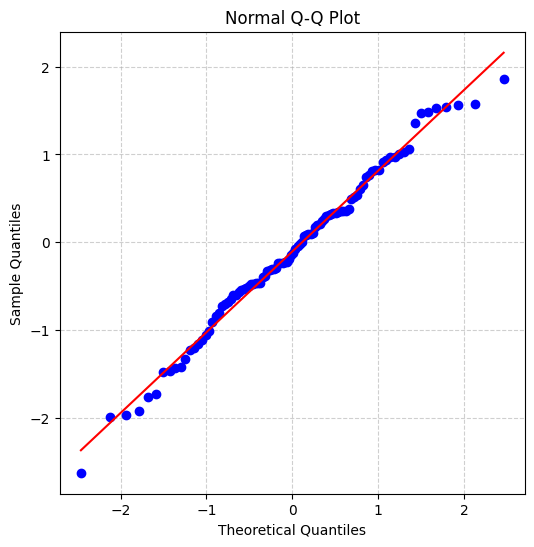

# 第17章　回帰診断法

> [!IMPORTANT]
> **【準1級での学習深度と対策】**
> モデルを作った「後」のチェック工程です。「外れ値」や「影響点」の定義と指標を区別して覚えましょう。
>
> 1.  **残差プロットの解釈（必須）**:
>     残差がランダムに散らばっていればOK。ファン型（等分散性の欠如）や曲線（非線形性）のパターンを見て、モデルの不備を指摘できるか。
> 2.  **影響力のある観測値**:
>     「てこ比」（説明変数の空間での遠さ）と「クックの距離」（回帰直線への影響力）の定義と判定基準（$0.5, 1$など）を暗記しましょう。
> 3.  **正規Q-Qプロット**:
>     残差の正規性を視覚的に確認する方法。直線に乗れば正規性あり。

線形回帰モデルの妥当性を評価するための診断手法です。

## 1. 残差プロットとモデルの仮定

> [!TIP]
> **【準1級合格のポイント：残差の理想形】**
> 残差プロットを見たとき、**「横軸に平行な帯状に、ランダムに散らばっている」** のが理想です。
> 何らかの模様（U字、ラッパ型）が見えたら、それはモデルの改善余地（変数変換や2次項の追加）を示唆します。

線形回帰モデルでは、誤差項 $\epsilon$ について以下の仮定を置きます。
- **独立性**: 互いに独立
- **等分散性**: 分散 $\sigma^2$ が一定
- **正規性**: 正規分布に従う

### 残差プロット (Residual Plot)
- **横軸**: 予測値 $\hat{y}$
- **縦軸**: 残差 $e = y - \hat{y}$

プロットに何らかの傾向（パターンの有無）がある場合、仮定が満たされていない可能性があります。
- **理想**: 0を中心にランダムにばらつく。
- **問題あり**:
    - **U字型**: 線形モデルが不適切（2次項が必要など）。
    - **ラッパ型**: 予測値によって分散が変化している（等分散性の欠如 $\to$ 変数変換や重み付き最小二乗法を検討）。
    
    - **ラッパ型**: 予測値によって分散が変化している（等分散性の欠如 $\to$ 変数変換や重み付き最小二乗法を検討）。
    
```mermaid
graph TD
    Residuals[残差プロットのパターン] --> A{形状は?}
    A -->|ランダム| OK[○: 問題なし (理想的)]
    A -->|U字型/逆U字| Poly[×: 非線形性あり (2次項の欠落)]
    A -->|ラッパ型 (拡張/収縮)| Hetero[×: 不均一分散 (等分散性の欠如)]
    
    style OK fill:#9f9,stroke:#333
    style Poly fill:#f99,stroke:#333
    style Hetero fill:#ff9,stroke:#333
```

### 正規Q-Qプロット (Normal Q-Q Plot)
残差の正規性を確認するグラフ。
- **横軸**: 標準正規分布の理論的分位点
- **縦軸**: 標準化残差の経験的分位点

点が**傾き1の直線状**に並べば、誤差項の正規性が満たされていると判断します。



> [!TIP]
> **【準1級合格のポイント：Q-Qプロットのパターン】**
> - **直線に乗る**: 正規性あり（OK）。
> - **S字カーブ / 逆S字**: 分布の裾が重い（尖度が大きい）または軽い。
> - **弓なり**: 分布が歪んでいる（歪度 $\ne$ 0）。
> 単に「直線なら正規性あり」だけでなく、直線からズレた場合の解釈も問われることがあります。

## 2. 影響力のある観測値の検出

> [!TIP]
> **【準1級合格のポイント：てこ比 vs クックの距離】**
> - **てこ比**: 「説明変数の値」が極端な点（$x$空間での外れ値）。$y$の値は見ません。
> - **クックの距離**: 「その点を除くと回帰直線がどれだけ動くか」を表す総合指標。てこ比と残差の両方を考慮します。
> 「てこ比が大きいが、回帰直線上に乗っている（残差0）」場合、クックの距離は小さくなり、影響点とはみなされません。この違いを理解しましょう。

モデルの推定結果に大きな影響を与えている「外れ値」や「特異点」を特定する指標です。

### てこ比 (Leverage)
説明変数空間において、あるデータ点が中心からどれだけ離れているか（影響力の大きさ）を表す指標。
ハット行列 $H = X(X^T X)^{-1} X^T$ の対角成分 $h_{ii}$ です。

- **性質**: $0 \le h_{ii} \le 1$、$\sum h_{ii} = d+1$（パラメータ数）。
- **判定**: 平均値 $(d+1)/n$ の2〜3倍を超えると高いてこ比とみなされることがあります。

> [!TIP]
> **【準1級：てこ比の学習ポイント】**
> 「具体的な計算」よりも **「ハット行列の対角成分である」** **「説明変数の平均から遠いほど値が大きくなる」** **「総和がパラメータ数になる」** といった**性質**が問われます。

### クックの距離 (Cook's Distance)
第 $i$ 番目のデータ点を除いたとき、回帰係数や予測値がどれだけ変化するかを表す指標。**てこ比**と**残差**の両方の情報を組み合わせたものです。

$$
D_i = \frac{\sum_{j=1}^n (\hat{y}_j - \hat{y}_{j(-i)})^2}{(d+1)\hat{\sigma}^2}
$$

- $\hat{y}_{j(-i)}$: データ $i$ を除いて推定したモデルによる予測値。
- **判定**: $D_i > 1$ あるいは $F$分布の分位点（たとえば $F(d+1, n-d-1; 0.5)$）などと比較して、大きい場合に「影響力が大きい」と判断します。

> [!TIP]
> **【準1級：クックの距離の学習ポイント】**
> 定義式を丸暗記する優先度は低めですが、**「その点を除去したときの影響力の大きさ」**という概念と、**「てこ比と残差の両方を考慮している」**（式の構成要素）という点は重要です。判定基準として $F$ 分布が使われる根拠（係数の信頼楕円との関連）も頭の片隅に置いておきましょう。

> [!TIP]
> **【試験対策：外れ値と影響点の違い】**
> - **外れ値 (Outlier)**: $y$ 方向（または $x$ 方向）に大きく外れた値。必ずしも回帰直線への影響力が大きいとは限らない（てこ比が小さい場合）。
> - **影響点 (Influential Point)**: その点を取り除くと回帰係数が大きく変わる点。高い**てこ比**と大きな**残差**を併せ持つことが多いです（クックの距離で判定）。

## 3. 系列相関について

> [!TIP]
> **【準1級合格のポイント：ダービン・ワトソン比の目安】**
> 統計量 $d$ は $0 \le d \le 4$ の値をとり、**$d \approx 2$** なら無相関（問題なし）です。
> 0に近いと正の相関、4に近いと負の相関があります。「2ならOK」と覚えておきましょう。

時系列データの場合、誤差項が独立でない（自己相関を持つ）可能性があります。
これを確認するには **ダービン・ワトソン比 (DW比)** を用いますが、詳細は [第27章 時系列解析](?note=27_時系列解析) を参照してください。
