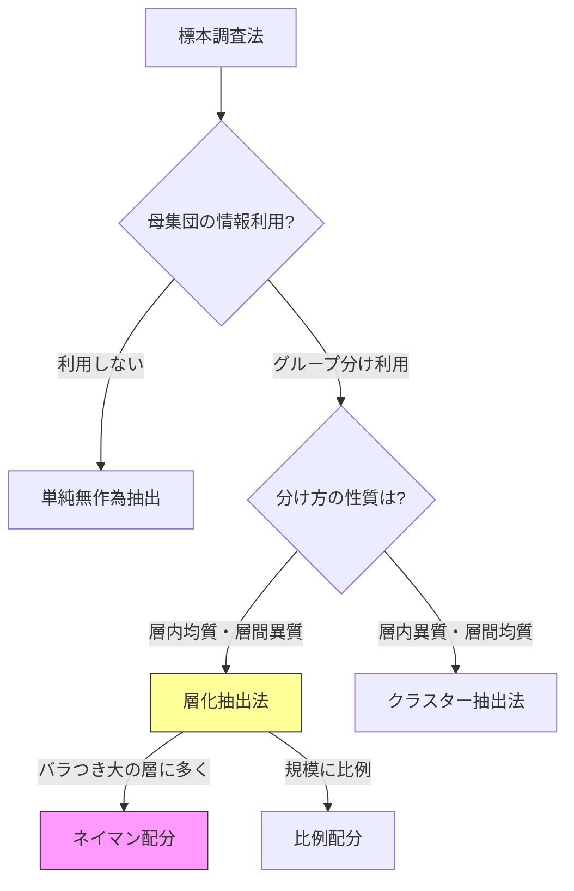

# 第21章　標本調査法

> [!IMPORTANT]
> **【準1級での学習深度と対策】**
> 各抽出法の「分散の大小関係」と「有限母集団修正」が頻出です。
>
> 1.  **層化抽出 vs クラスター抽出**:
>     「層内は均一、層間は異質」にする層化抽出と、「小集団（クラスター）自体が母集団の縮図」であるクラスター抽出の違いを完全に理解しましょう。
>     精度は一般に **層化抽出 $\ge$ 単純無作為 $\ge$ クラスター抽出** となります。
> 2.  **ネイマン配分**:
>     層化抽出において分散を最小化する最適配分 $n_i \propto N_i \sigma_i$ の公式を覚え、計算できるように。
> 3.  **有限母集団修正**:
>     母集団サイズ $N$ が小さいとき、分散に $\frac{N-n}{N-1}$ を掛ける補正を忘れないように。

## 1. 単純無作為抽出 (Simple Random Sampling)

> [!TIP]
> **【準1級合格のポイント：有限母集団修正】**
> $N$ が小さいとき、分散が小さくなる（$\times \frac{N-n}{N-1}$）ことを忘れないでください。
> 非復元抽出では「情報が尽きていく」ため、復元抽出（修正なし）よりも精度が良くなります。

母集団からランダムに標本を抽出する方法。
以下、非復元抽出（同じ対象を2回選ばない）を考えます。
- $N$: 母集団の大きさ
- $n$: 標本の大きさ（サンプルサイズ）
- **有限母集団修正**: 母集団が有限 ($N$) であるため、推定量の分散に修正項がかかります。

### 標本平均の性質
母平均 $\mu$、母分散 $\sigma^2$ の母集団からサイズ $n$ の標本を抽出する場合。
- **期待値**: $E[\bar{X}] = \mu$ （不偏推定量）
- **分散**:
  $$
  V[\bar{X}] = \frac{N-n}{N-1} \frac{\sigma^2}{n} = \left(1 - \frac{n-1}{N-1}\right) \frac{\sigma^2}{n}
  $$
  係数 $\frac{N-n}{N-1}$ を**有限母集団修正係数**と言います。
  $N$ が非常に大きい（$N \gg n$）場合、この係数は 1 に近づき、通常の分散 $\sigma^2/n$ になります。

## 2. 層化抽出法 (Stratified Sampling)

> [!TIP]
> **【準1級合格のポイント：層化抽出の極意】**
> 「層内は似たもの同士（分散小）、層間は違うもの同士（分散大）」に分けるのがコツです。
> こうすることで、各層の代表値を精度よく推定でき、全体としての精度も上がります。クラスター抽出（層内がバラバラ）との対比で覚えましょう。

母集団をいくつかのグループ（**層**）に分け、各層から無作為抽出する方法。
- **目的**: 母集団全体の推定精度を上げる。
- **原則**: **層内は均質**に、**層間は異質**になるように分けると精度が良くなる。

### 記号
- $L$ 個の層。全体の大きさ $N = \sum N_i$。
- 第 $i$ 層: 大きさ $N_i$、抽出数 $n_i$、母分散 $\sigma_i^2$。

## 3. 標本配分法 (Allocation Methods)

> [!TIP]
> **【準1級合格のポイント：ネイマン配分の意味】**
> $n_i \propto N_i \sigma_i$ という式は非常に合理的です。
> 「人口 $N_i$ が多い県」と「貧富の差（ばらつき $\sigma_i$）が激しい県」には、より多くの調査員を派遣すべきです。
> 逆に、全員同じ年収（$\sigma_i \approx 0$）なら、1人聞けば十分なのでサンプルは少なくて済みます。

層化抽出において、総サンプルサイズ $n$ を各層 $n_i$ にどう配分するか。

### (1) 比例配分 (Proportional Allocation)
層の大きさに比例して配分する方法。
$$
n_i = n \times \frac{N_i}{N}
$$
- **特徴**: 単純無作為抽出よりも常に精度（分散）が良くなるか、同等であることが保証される。

### (2) ネイマン配分 (Neyman Allocation)
推定量の分散を最小にする（精度を最良にする）配分方法。
$$
n_i = n \times \frac{N_i \sigma_i}{\sum N_j \sigma_j}
$$
- **特徴**: 層の大きさ $N_i$ が大きく、かつ**層内のばらつき $\sigma_i$ が大きい層**に多く配分する。

### (3) 等配分 (Equal Allocation)
各層から同数ずつ抽出する。
$$
n_i = \frac{n}{L}
$$

> [!TIP]
> **【準1級合格のポイント：抽出法の比較と公式】**
> - **有限母集団修正係数**: $\frac{N-n}{N-1}$。サンプリング比率 $n/N > 0.05$ (5%) 程度を超えたら適用を考えます。「母集団が小さいほど、選んだ1個が全体に与える影響が大きい」ため、分散は小さくなります。
> - **ネイマン配分**: $n_i \propto N_i \sigma_i$。
>   **「人口 $N_i$ が多くて、かつバラつき $\sigma_i$ が大きい村からは、より多くの調査員 $n_i$ を出すべき」** と考えれば忘れません。
> - **精度比較**: 一般に、**層化抽出 $\ge$ 単純無作為 $\ge$ クラスター抽出**（クラスターは楽だが精度低い）。
