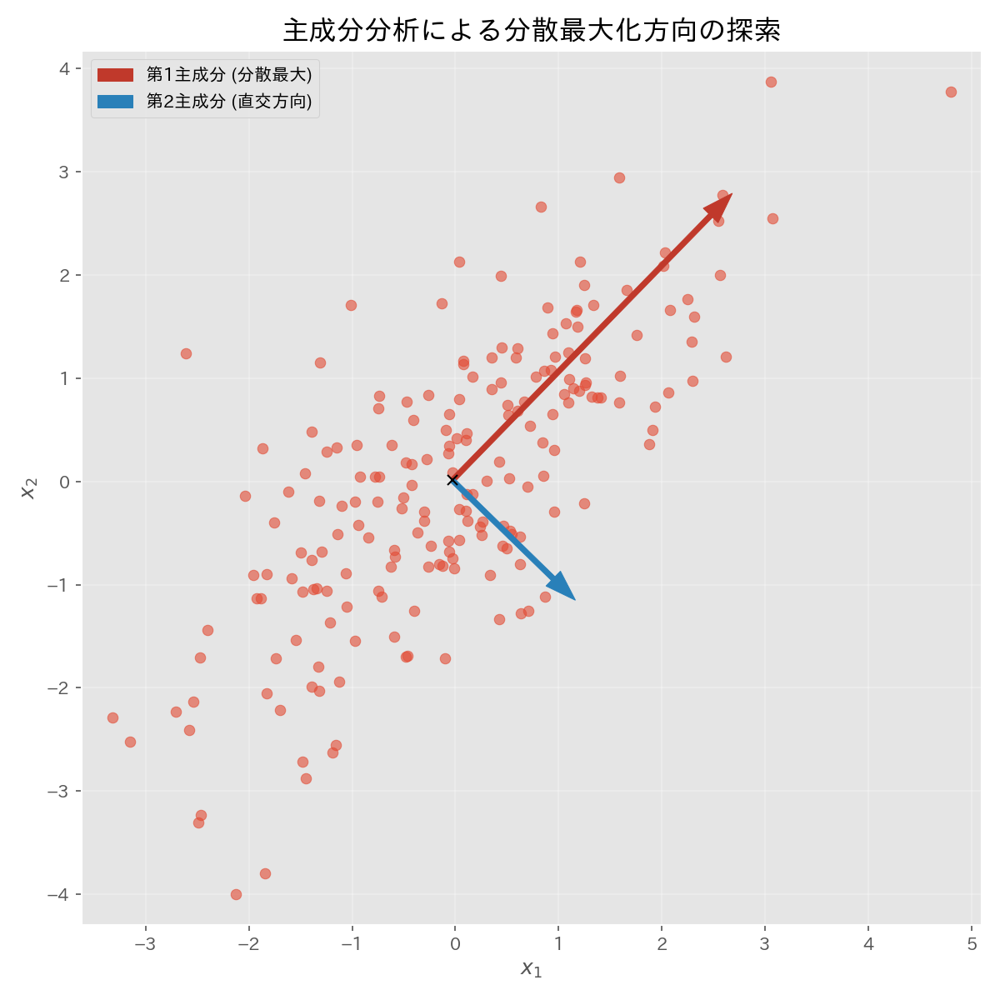

# 第22章　主成分分析 (Principal Component Analysis; PCA)

> [!IMPORTANT]
> **【準1級での学習深度と対策】**
> 多変量解析の中で最も出題頻度が高い手法の一つです。固有値と寄与率の関係が全てです。
>
> 1.  **寄与率と累積寄与率（必須）**:
>     第 $k$ 主成分の重要度を表す寄与率 $\lambda_k / \sum \lambda_i$ の計算。累積寄与率80%などの基準で主成分数を決める手順。
> 2.  **主成分負荷量**:
>     「元の変数と主成分の相関係数」としての負荷量の定義と、それを用いた主成分の意味づけ（ネーミング）ができるように。
> 3.  **分散共分散行列 vs 相関行列**:
>     変数の単位が異なる場合は標準化（相関行列）を用いるべき理由を理解しましょう。

```mermaid
graph TD
    Data[多変量データ X] --> Choice{単位は揃っている?}
    Choice -->|Yes| Cov[分散共分散行列 S]
    Choice -->|No| Cor[相関行列 R (標準化)]
    
    Cov --> Eigen[固有値・固有ベクトル計算]
    Cor --> Eigen
    
    Eigen --> PC1[第1主成分 (最大固有値)]
    Eigen --> PC2[第2主成分]
    
    PC1 --> Selection{累積寄与率 > 80%?}
    PC2 --> Selection
```

## 1. 主成分分析の概要

> [!TIP]
> **【準1級合格のポイント：次元削減の目的】**
> 「情報の損失を最小限にする」とは、「分散（散らばり）を最大化する」ことと同義です。
> データが最も散らばっている方向こそが、最も個体差（情報）を表している軸だからです。

多数の変数を、情報の損失を最小限に抑えつつ、少数の「総合指標（主成分）」に要約する次元削減の手法。
元の変数 $x_1, \dots, x_p$ の線形結合によって、分散（情報量）が最大になるような新しい軸 $y$ を求めます。

$$
y_i = w_{1i} x_1 + \dots + w_{pi} x_p = \mathbf{w}_i^T \mathbf{x}
$$
ただし、係数ベクトルは正規化されています（$\|\mathbf{w}_i\| = 1$）。



## 2. 数学的定式化

> [!TIP]
> **【準1級合格のポイント：分散共分散行列か相関行列か】**
> - **分散共分散行列**: 単位が同じ（例：全員のテスト点数）ならこちら。分散の大きい科目が重視されます。
> - **相関行列**: 単位が違う（例：身長cmと体重kg）ならこちら。標準化して平等に扱います。
> 試験や実務では後者が圧倒的に多いです。

### 分散共分散行列に基づくPCA
変数の単位が揃っている場合や、変数のスケール（分散の大きさ）そのものに意味がある場合に用います。
標本分散共分散行列 $S$ の固有値問題を解きます。

- **固有値**: $\lambda_1 \ge \lambda_2 \ge \dots \ge \lambda_p \ge 0$
- **固有ベクトル**: $\mathbf{w}_1, \mathbf{w}_2, \dots, \mathbf{w}_p$

第 $k$ 主成分の分散は、第 $k$ 固有値 $\lambda_k$ に一致します。
$$
V[y_k] = \mathbf{w}_k^T S \mathbf{w}_k = \lambda_k
$$

### 相関行列に基づくPCA
変数の単位が異なる場合（身長と体重など）は、標準化（平均0, 分散1）してから分析します。これは相関行列 $R$ の固有値問題を解くことと同義です。
- 固有値の総和は変数の数 $p$ になります（$\sum \lambda_i = p$）。

## 3. 寄与率と累積寄与率

> [!TIP]
> **【準1級合格のポイント：基準の目安】**
> - **累積寄与率**: 80%あれば十分な情報量が保たれていると判断します。
> - **固有値**: 1以上（平均的な変数1個分以上の情報量）を採用基準にすることもあります（カイザー基準）。

### 寄与率 (Contribution Ratio)
第 $k$ 主成分が、全変動のどれだけを説明しているかの割合。
$$
C_k = \frac{\lambda_k}{\sum_{j=1}^p \lambda_j}
$$

### 累積寄与率 (Cumulative Contribution Ratio)
第 $m$ 主成分までの寄与率の合計。
$$
Cr_m = \sum_{k=1}^m C_k
$$
- **基準**: 一般に累積寄与率が **80%** を超えるまでの主成分を採用することが多い（スクリープロット等で判断）。

> [!TIP]
> **【準1級合格のポイント：主成分数の決定】**
> - **累積寄与率**: 80%程度を目安にする。
> - **スクリープロット**: 固有値をグラフにし、傾きが急激に緩やかになる直前までを採用する。
> - **カイザー基準（Kaiser Criterion）**: 固有値が1以上の主成分を採用する（相関行列の場合）。

## 4. 主成分負荷量 (Factor Loading)

> [!TIP]
> **【準1級合格のポイント：図形的意味】**
> 主成分負荷量は、「第 $k$ 主成分軸」と「元の変数軸」のなす角のコサイン（相関係数）です。
> 負荷量プロットにおいて、原点から近い変数はその主成分とは無関係、遠い変数は強く関係していると読み取ります。

第 $k$ 主成分 $y_k$ と、元の変数 $x_j$ との相関係数。

> [!TIP]
> **【主成分の解釈（ネーミング）】**
> - **第一主成分**: すべての変数と正の相関を持つことが多く、「総合指標（サイズ因子）」と解釈されることが多いです。
> - **第二主成分以下**: 正負の符号が混在し、「対比（形状因子）」を表すことが多いです。
> - 因子負荷量の絶対値が大きい変数が、その主成分の意味を決定づけます。

主成分の意味解釈（「サイズ因子」「形状因子」など）に用いられます。

分散共分散行列の場合：
$$
r(y_k, x_j) = \frac{\sqrt{\lambda_k} w_{jk}}{\sqrt{V[x_j]}}
$$

相関行列（標準化変数）の場合（$V[x_j]=1$）：
$$
r(y_k, x_j) = \sqrt{\lambda_k} w_{jk}
$$

## 5. 自己符号化器 (Autoencoder)

> [!TIP]
> **【準1級合格のポイント：PCAとの関係】**
> 「中間層が線形で、損失関数が二乗誤差なら、PCAと同じ部分空間を学習する」という事実は重要です。
> ニューラルネットワークはPCAの非線形拡張（一般化）と捉えることができます。

ニューラルネットワークを用いた非線形な次元削減手法。
- 入力層と同じ次元の出力層を持ち、「入力 $\approx$ 出力」となるように中間層（低次元）の特徴を学習します。
- 数式的には、中間層が線形活性化関数の場合、PCAと類似した部分空間を学習することが知られています。
