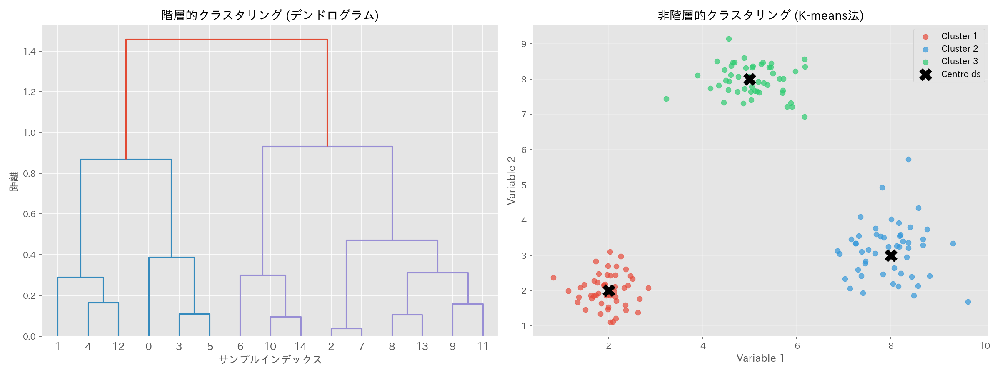

# 第24章　クラスター分析

> [!IMPORTANT]
> **【準1級での学習深度と対策】**
> 階層的クラスタリングの各手法の特徴（長所・短所）とデンドログラムの読み取りがメインです。
>
> 1.  **距離の定義**:
>     ユークリッド距離だけでなく、マンハッタン距離やマハラノビス距離の使い分けを知っておきましょう。
> 2.  **階層的手法の比較（必須）**:
>     最短距離法（鎖効果）、最長距離法、群平均法、そして**ウォード法**（平方和の増加を最小化）。特にウォード法の特徴と計算原理は重要です。
> 3.  **K-means法**:
>     非階層的手法の代表格。初期値依存性や、球状クラスターしかうまく扱えない弱点を理解しておきましょう。

## 1. 距離の定義

> [!TIP]
> **【準1級合格のポイント：マンハッタン距離】**
> シティブロック距離とも呼ばれます。碁盤の目のような道路網を進む距離です。
> 外れ値の影響を（二乗するユークリッド距離より）受けにくい性質があります。

個体間の「似ている度合い」を距離で測ります。
$x = (x_1, \dots, x_p)$, $y = (y_1, \dots, y_p)$ とします。

- **ユークリッド距離 (Euclidean Distance)**:
  $$
  d(x, y) = \sqrt{\sum_{i=1}^p (x_i - y_i)^2}
  $$
- **マンハッタン距離 (Manhattan Distance)**:
  $$
  d(x, y) = \sum_{i=1}^p |x_i - y_i|
  $$
- **マハラノビス距離**: 変数間の相関を考慮した距離（[判別分析](23_判別分析.md#3-マハラノビス距離による判別)参照）。

## 2. 階層的クラスタリング (Hierarchical Clustering)

> [!TIP]
> **【準1級合格のポイント：ウォード法の優位性】**
> 誤差平方和の増加分を距離とするウォード法は、バランスの良いクラスターを作りやすく、実務・試験ともに最もよく使われます。
> 「鎖効果」という弱点を持つ最短距離法と比較して覚えましょう。

```mermaid
graph TD
    subgraph デンドログラム(樹形図)
    N1((1)) --- C1
    N2((2)) --- C1[距離小]
    C1 --- C2
    N3((3)) --- C2[距離大]
    
    C2 --> Final[統合クラスター]
    N4((4)) --> Final
    end
    
    subgraph 切断ライン
    Line[切断高さを変えるとクラスタ数が変化]
    end
```

個体を順次結合していき、樹形図（**デンドログラム**）を作成する手法。

### クラスター間の距離定義（併合手法）
クラスター $C_1, C_2$ 間の距離 $D(C_1, C_2)$ の定義方法によって特性が変わります。

| 手法 | 定義 | 特徴 |
| :--- | :--- | :--- |
| **最短距離法** (Single Linkage) | 最も近い個体間の距離 | **鎖効果** (chaining) が起きやすく、細長いクラスターになりがち。 |
| **最長距離法** (Complete Linkage) | 最も遠い個体間の距離 | 丸いクラスターになりやすい。外れ値に弱い。 |
| **群平均法** (Group Average) | すべての個体ペアの距離の平均 | バランスが良い。単調性が保証される。 |
| **重心法** (Centroid Method) | 重心間の距離 | 距離の単調性が保証されない（併合が進むと距離が小さくなることがある）。 |
| **ウォード法** (Ward's Method) | 併合による「平方和の増加量」を最小化 | 分類感度が良く、よく使われる。計算量は多い。 |

## 3. 非階層的クラスタリング (Non-hierarchical Clustering)

> [!TIP]
> **【準1級合格のポイント：K-means法の注意点】**
> ビッグデータにも適用できる計算速度が魅力ですが、
> 1. 初期値によって結果が変わる（局所解）。
> 2. クラスター数 $K$ を事前に決める必要がある。
> 3. 球状でないクラスター（三日月型など）はうまく分類できない。
> という３つの弱点があります。

あらかじめクラスター数 $K$ を決めて分類する手法。

### K-means法
1. **初期化**: $K$ 個のクラスター中心（シード）をランダムに決定。
2. **割り当て**: 全データを最も近い中心のクラスターに割り当てる。
3. **更新**: 各クラスターの新しい重心（平均）を計算し、中心を更新する。
4. **収束判定**: 中心が動かなくなるまで 2-3 を繰り返す。

- **欠点**: 初期値依存性がある（局所解に陥りやすい）。外れ値の影響を受けやすい。



> [!TIP]
> **【準1級合格のポイント：手法の使い分け】**
>
> | 手法 | メリット | デメリット/特徴 |
> | :--- | :--- | :--- |
> | **ウォード法** | 分類感度が高い、バランス良い | 今日の主流。計算量多い。 |
> | **最短距離法** | 計算が速い | **鎖効果**（鎖状にクラスターがつながる） |
> | **最長距離法** | | 丸いクラスターになる |
> | **群平均法** | | 単調性（距離が増加し続ける）あり |
>
> **デンドログラムの読み取り**:
> 縦軸の「距離（非類似度）」が大きいところで切断するとクラスター数は少なく、下の方で切断すると多くなります。「距離20で切ると3つのクラスターになる」といった読み取りが必須です。
