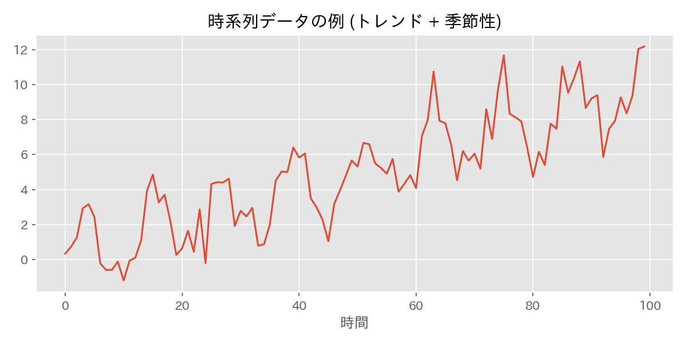
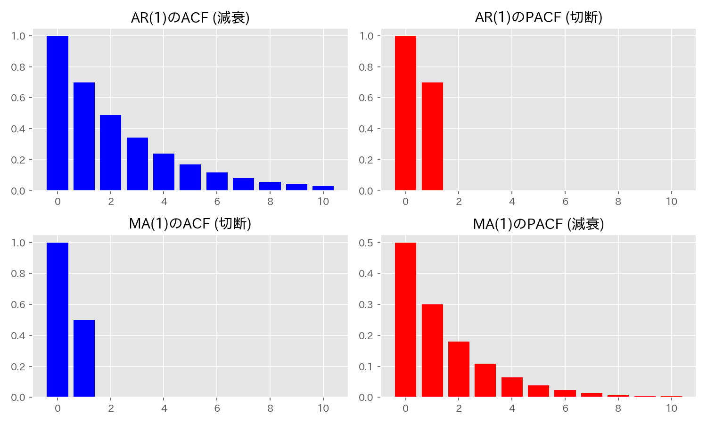

# 第27章　時系列解析 (Time Series Analysis)

> [!IMPORTANT]
> **【準1級での学習深度と対策】**
> AR/MA/ARMAモデルの識別と、定常性の検証プロセスが問われます。
>
> 1.  **モデル識別（ACFとPACF）（必須）**:
>     ARモデル（ACF減衰、PACF切断）とMAモデル（ACF切断、PACF減衰）の特徴を表で覚え、コレログラムから次数を推定できるように。
> 2.  **単位根検定 (ADF検定)**:
>     「帰無仮説：単位根あり（非定常）」であることに注意。棄却されたら定常とみなせる、というロジックを間違えないように。
> 3.  **定常性の定義**:
>     弱定常性（平均・分散が一定、自己共分散がラグのみに依存）の定義式を書けるようにしましょう。

## 1. 時系列データの基本概念

- **弱定常性 (Weak Stationarity)**:
  1. 平均 $E[Y_t] = \mu$ が一定。
  2. 分散 $V[Y_t] = \sigma^2$ が一定。
  3. 自己共分散 $Cov(Y_t, Y_{t-h}) = \gamma_h$ が時点 $t$ によらず、ラグ $h$ だけで決まる。
- **ホワイトノイズ (White Noise)**: $E[\epsilon_t]=0, V[\epsilon_t]=\sigma^2$, 異なる時点間で無相関な系列。

## 2. 時系列モデル
### (1) AR(p) 過程 (Auto-Regressive)
「現在の値は過去の値に依存する」モデル。
$$
Y_t = c + \phi_1 Y_{t-1} + \dots + \phi_p Y_{t-p} + \epsilon_t
$$
- **定常条件**: 特性方程式 $1 - \phi_1 z - \dots - \phi_p z^p = 0$ の解の絶対値がすべて1より大きい（単位円の外にある）こと。
  - 例: AR(1) $Y_t = \phi Y_{t-1} + \epsilon_t$ は $|\phi| < 1$ で定常。

### (2) MA(q) 過程 (Moving Average)
「現在の値は過去の誤差（ショック）の積み重ねである」モデル。常に定常です。
$$
Y_t = c + \epsilon_t + \theta_1 \epsilon_{t-1} + \dots + \theta_q \epsilon_{t-q}
$$

### (3) ARMA(p, q) 過程
ARとMAを組み合わせたモデル。
$$
Y_t = c + \sum_{i=1}^p \phi_i Y_{t-i} + \epsilon_t + \sum_{j=1}^q \theta_j \epsilon_{t-j}
$$

### (4) ARIMA(p, d, q) 過程
原系列が非定常でも、差分（$d$ 階差分）をとることで定常なARMA(p, q)になるモデル。
- **単位根過程**: ランダムウォーク ($Y_t = Y_{t-1} + \epsilon_t$) など。

## 3. モデルの識別 (ACFとPACF)

| モデル | 自己相関 (ACF) | 偏自己相関 (PACF) |
| :--- | :--- | :--- |
| **AR(p)** | 指数的に減衰 | **ラグ $p$ で切断** (0になる) |
| **MA(q)** | **ラグ $q$ で切断** (0になる) | 指数的に減衰 |
| **ARMA(p,q)** | 減衰する | 減衰する |

- **コレログラム**: ACF/PACFをグラフにしたもの。信頼区間（青い帯）を出ると有意と判断。

> [!TIP]
> **【ACF/PACFの読み取り方】**
> - **「切断」**：信頼区間（青い帯）を**超えるラグが突然なくなる**こと。最後の有意なラグが次数となる。
> - **「減衰」**：信頼区間内に入ったり出たりしながら、徐々に0に近づいていくこと。

## 4. 各種検定
### (1) 単位根検定 (Dickey-Fuller検定)
データが定常か非定常（単位根を持つか）を調べる検定。
- $H_0$: 単位根を持つ（非定常）。$\phi = 1$。
- $H_1$: 定常である。$|\phi| < 1$。
※ 通常のt検定ではなく、**Dickey-Fuller分布**を用います。

> [!TIP]
> **【準1級合格のポイント：単位根検定の罠】**
> 多くの検定（適合度など）では「帰無仮説＝モデルに当てはまる（平和な状態）」ですが、単位根検定では**「帰無仮説＝非定常（単位根あり）」**です。
> つまり、「棄却されたら定常（分析OK）」となります。この逆転に注意してください。

### (2) ダービン・ワトソン検定 (Durbin-Watson Test)
回帰分析の**残差に系列相関があるか**を調べる検定。
$$
DW \approx 2(1 - \hat{\rho})
$$
- $DW \approx 2$: 相関なし。
- $DW < 2$ (0に近い): **正**の自己相関。
- $DW > 2$ (4に近い): **負**の自己相関。

## 5. スペクトル解析
時系列を周波数成分に分解する解析（フーリエ変換の応用）。
- **スペクトル密度関数**: 周波数 $\lambda$ ごとの強さ（分散への寄与）を表す関数。
- AR過程は低周波（トレンド）成分が強く、MA過程は平滑化効果に関連します。
